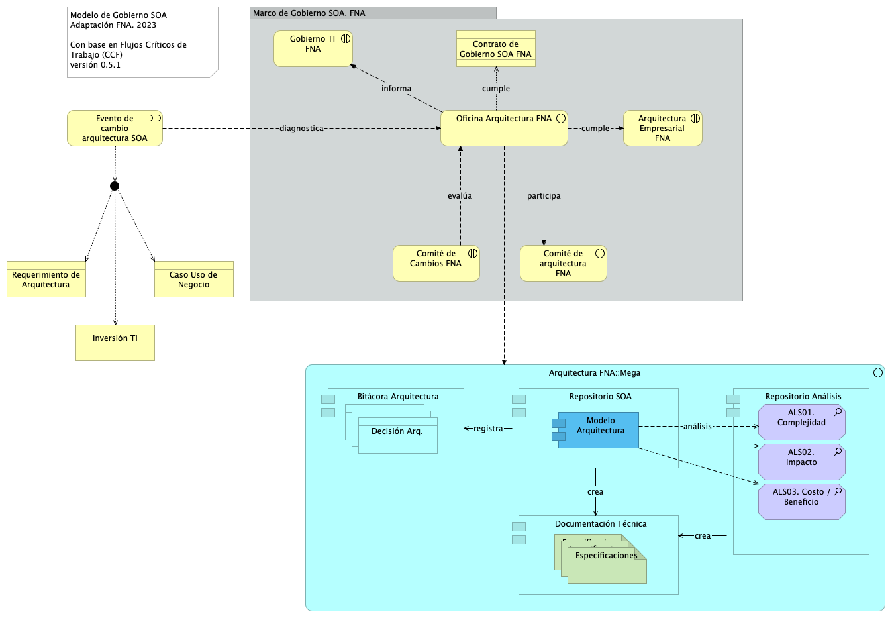

---
geometry:
  - top=1in
  - bottom=1in
fignos-cleveref: True
fignos-plus-name: Fig.
fignos-caption-name: Imagen
tablenos-caption-name: Tabla
...

| Tema           | Gobierno SOA del FNA: **Modelo de Gobierno y CCF**                                                            |
|----------------|---------------------------------------------------------------------------------------------------------------|
| Palabras clave | SOA, Contexto, Áreas, Procesos, Objetivos                                                                     |
| Autor          |                                                                                                               |
| Fuente         |                                                                                                               |
| Versión        | **1.$COMMIT** del $FECHA_COMPILACION                                                                          |
| Vínculos       | [Ejecución Plan de Trabajo SOA](onenote:#N001d.sharepoint.com); [Procesos de Negocio FNA](onenote:#N003a.com) |

 

# Antecedentes del Gobierno SOA del FNA
Los resultados de la consultoría E-Service, Fase I, 2022 señalan la _necesidad de manejo de la complejidad creciente en las soluciones del FNA_ (ver [Resultados E-Service, Fase I](https://stefaninilatam.sharepoint.com/SitePages/Home.aspx)). Sobre esa base, El Fondo Nacional del Ahorro estableció como pilar tecnológico la implementación obligatoria del Gobierno SOA, de forma tal, que preserve la continuidad de servicio y permita identificar y gestionar las amenazas y riesgos que impacten el desarrollo y evolución de las arquitecturas de software del Fondo, tarea base para los planes de alineación y puesta marcha de futuras soluciones y mejoras.

# Modelo de Gobierno SOA del FNA: Actores, Información y Procedimientos
El gobierno SOA del FNA, objeto de este proyecto, tiene impacto general en la empresa. Sin embargo, se desarrolla desde un centro condicionado por el alcance de este proyecto. Esta versión del Gobierno SOA del FNA nace en las partes e ítems de la arquitectura de software y de servicios del FNA consignadas en la vista de segmento de la empresa (ver Vista de Contextual, segmento de la empresa, [PR01. E-Service, Fase II](https://https://stefaninilatam.sharepoint.com/SitePages/Home.aspx/fna-dd-f2-pry1/manuscript.pdf)) pero no se agota ahí porque es necesario extenderlo a actores, interesados, usuarios y entidades relacionados con las partes de la arquitectura del FNA contenidas en la vista de segmento.

A cotinuación presentamos el modelo base de gobierno de arquiteturas SOA para el FNA, primera edición, versión 0.1.

# Modelo de Gobierno SOA del FNA. Versión 0.2
La versión inicial del modelo de Gobierno SOA del FNA, propuesto en la Fase I de E-Service establece apenas las bases de lo que debe ser un marco de trabajo para gobierno SOA del FNA. Esta versión hace foco en un asunto general: _responder y gestionar la evolutición de la arquitectura de referencia SOA actual del Fondo Nacional del Ahorro_, y deja para siguientes versiones de este marco de trabajo de gobierno SOA la inclusión de otras problemáticas que demanden mayor gobierno.

{#fig: width=}

_Fuente: Diagnóstico SOA. E-Service (2022)._

 

# Modelo de Gobierno SOA del FNA. Versión 0.5
Ahora incorporamos en el modelo de gobierno del FNA el resultado del diagnóstico de susceptibilidad de gobierno realizado sobre los flujos críticos de trabajo elaborados en la Etapa 0 de este proyecto (ver [Flujos Críticos de Trabajo FNA](https://stefaninilatam.sharepoint.com/SitePages/Home.aspx)) con el fin de dar darle gestión a las problemáticas encontradas en dicho diagnóstico. El diagrama siguiente presenta el mopdelo de gobierno resultante. 

La nueva versión del modelo de gobierno del FNA incorpora las problemáticas encontradas en el producto 1 de este proyecto.

{#fig: width=}

_Fuente: Elaboración propia._

 

## Elementos del Modelo de Gobierno, versión 0.5
Descripción de los elementos del modelo de gobierno.

| Nombre| Tipo| Descripción| Propds.
|:--------|:--------|:--------|:--------|
|**Bitácora Arquitectura**|application-component|La bitácora de decisiones de arquitectura (ADR, por sus siglas en ingés) es una herramienta para ejercitar el proceso de toma de decisiones de la oficina. Mediante esta es posible estructurar y hacer seguimiento (versión y trazabilidad) a las discusiones de la oficina de arquitectura del FNA. Cumple el objetivo de materializar el consenso elevándolo a un grado oficial, al tiempo que reune a los arquitectos alrededor del mismo contexto, problema, restricciones, conveniencia (pro/con), alternativas y opciones de solución.||
|**Documentación Técnica**|application-component|||
|**Gestor de Requerimientos de arquitectura**|application-component|||
|**Modelo Arquitectura**|application-component|||
|**Repositorio Análisis**|application-component|||
|**Repositorio SOA**|application-component|||
|**Arquitectura FNA
Mega**|application-interaction|||
|**Especificaciones**|artifact|||
|**Especificaciones**|artifact|Métricas, conclusiones, decisiones ||
|**Especificaciones (copy)**|artifact|||
|**ALS01. Complejidad**|assessment|||
|**ALS02. Impacto**|assessment|||
|**ALS03. Costo / Beneficio**|assessment|||
|**ALS04. Específicos***|assessment|||
|**Evento de cambio arquitectura SOA**|business-event|Sucede un evento en que la arquitectura SOA, o alguna de los componentes de la arquitectura de referencia del FNA es imputado por un cambio. El cambio puede ser motivado por un requerimiento de arquitectura (TOGAF), una necesidad de negocio, o la adquisición de infraestructura (inversión de TI).||
|**Arquitectura Empresarial FNA**|business-interaction|||
|**Comité de Cambios FNA**|business-interaction|||
|**Comité de arquitectura FNA**|business-interaction|||
|**Gobierno TI FNA**|business-interaction|||
|**Oficina Arquitectura FNA**|business-interaction|La ofifina de arquitetura del FNA (LOAF) recibe (y puede objetar) el requerimiento de arquitecura.  La objeción de un requerimiento puede ser discutido por el Comité de Arquitectura. Inmediatamente aceptado el requerimiento, los arquitectos en cada dominio deben iniciar los análisis sobre modelos. Si no existe modelos, estos deben ser realizados previo a los análisis. ||
|**Caso Uso de Negocio**|business-object|||
|**Inversión TI**|business-object|||
|**Requerimiento de Arquitectura**|business-object|||
|**Contrato de Gobierno SOA FNA**|contract|||
|**Declaración Trabajo Arquitectura**|contract|La declaración de trabajo de arquitectura define el alcance y el enfoque que se utilizará para completar un ciclo de desarrollo de arquitectura (ver flujo de trabajo de oficina de arquitectura FNA). Debe contener los elementos contra los que se medirá la ejecución exitosa del proyecto/cambio de arquitectura. Es además el insumo para los acuerdos contractuales entre el proveedor y la empresa.||
|**Requerimiento**|contract|||
|**Requerimiento**|contract|||
|**Requerimiento**|contract|||
|**Decisión**|data-object|||
|**Decisión (copy)**|data-object|||
|**Decisión Arq.**|data-object|||

 

## Bitácora de Decisiones de Arquitectura
La bitácora de decisiones es una herramienta para gestionar la toma de decisiones de arquitectura. Por tal razón, estructurar y genera gestión seguimiento, (versión y trazabilidad) a las discusiones de la oficina de arquitectura del FNA. El objetivo de esta herramienta es el de consensuar a todos los arquitectos alrededor del mismo contexto, problema, restricciones, conveniencia (pro/con), alternativas y opciones de solución.

Para poner en marcha una especialización de la ADR (bitácora de arquitectura), vea [Consideraciones para Operar la Bitácora](https://stefaninilatam.sharepoint.com/SitePages/Home.aspx).

## Declaración de Trabajo de Arquitectura
La declaración de trabajo de arquitectura define el alcance y el enfoque que se utilizará para completar un ciclo de desarrollo de arquitectura (ver flujo de trabajo de oficina de arquitectura FNA). Debe contener los elementos contra los que se medirá la ejecución exitosa del proyecto/cambio de arquitectura. 

El objetivo de esta información es ser el insumo para la toma de decisiones de la gestión de tecnología del FNA, y servir en el dimensionamiento y gestión de los acuerdos contractuales entre el proveedor y la empresa.

La declaración de trabajo puede contener, como mínimo, 

* Descripción del trabajo/solicitud
* Contexto tras el trabajo (solicitud) de arquitectura
* Denominación del proyecto de arquitectura y alcance (una vez aprobado el cambio)
* Prerequisitos para la ejecución del cambio (Vision)
* Esquema de trabajo del cambio en cada dominio y componente de la arquitectura
* Equipo de trabajo, roles, responsabilidades y entregables
* Criterios de aceptación
* Plan de trabajo y calendario
* Aprobaciones

## Repositorio SOA
## Repositorio Análisis
## Documentación Técnica

Este modelo de gobierno está diseñado para enfrentar el caso particular del FNA que es aumentar la relevancia de los de modelos de arquitectura, que funcionen como lenguaje común entre los autores y actores, y la graduación del uso del repositorio de artefactos de arquitectura e ingeniería. En este modelo de gobierno, v0.5 que diseñamos para la empresa, _el repositorio de arquitectura es el corazón del gobierno_; lo mismo para la oficina del arquitectua del FNA. Es también la base de los análisis de ingeniería que se comparten con proveedores y contratistas del Fondo Nacional del Ahorro.

El requerimiento de arquitectura, sea un Caso de Uso (nivel 0: negocio), una inversión de TI, sea adquisición, migración, consultoría (nivel 1:incidencia), o un requierimiento no funcional (nivel 2:ingeniería), es la entrada principal del modelo de gobierno. 

Una vez definido esta nueva versión del modelo de gobierno del FNA, y descrito sus elementos, debemos dotarlo de un sentido operativo. Esto se hace mediante la declaración de las funciones y objetivos del gobierno a los que este modelo debe ceñirse y responder. De igual manera, los roles que constituyen la oficina de arquitectura del FNA.

 

