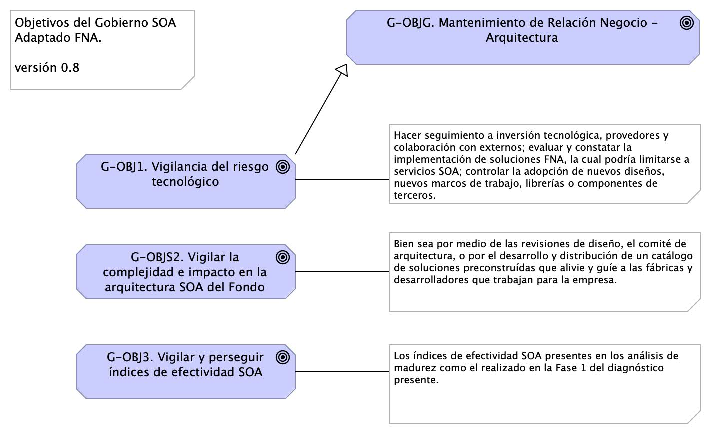
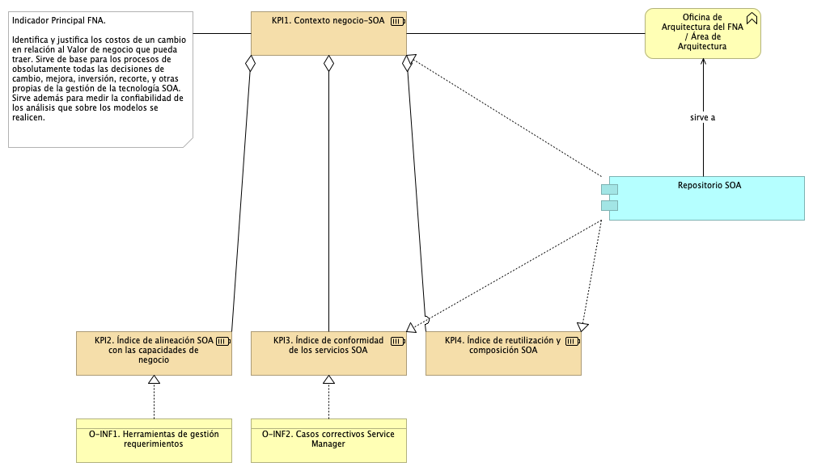
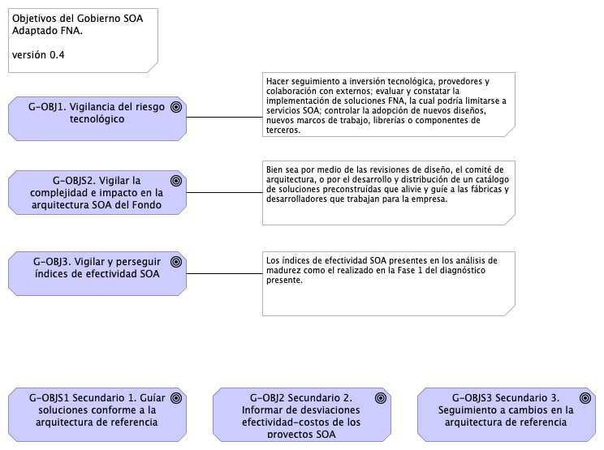

---
geometry:
  - top=1in
  - bottom=1in
fignos-cleveref: True
fignos-plus-name: Fig.
fignos-caption-name: Imagen
tablenos-caption-name: Tabla
...

| Tema           | Modelo de Gobierno SOA. v0.5: **Objetivos del Gobierno** |
|----------------|--------------------------------------------------------------------------------|
| Palabras clave | SOA, Contexto, Áreas, Procesos, Objetivos                                      |
| Autor          |                                                                                |
| Fuente         |                                                                                |
| Versión        | **1.$COMMIT** del $FECHA_COMPILACION                                           |
| Vínculos       | [Ejecución Plan de Trabajo SOA](onenote:#N001d.sharepoint.com); [Procesos de Negocio FNA](onenote:#N003a.com)|

 

## Objetivo Principal del Gobierno SOA del FNA
Una vez identificadas estas problemáticas existentes en la empresa FNA, y que podemos resumir en 1) riesgo tecnológico, 2) complejidad y 3) nivel de formalización de la arquitectura dentro de los desarrollos e implementaciones del FNA, el gobierno SOA propuesto para el Fondo, versión 0.5, tiene un objetivo general que es el siguiente

> El gobierno SOA es el vigía de las relaciones entre las áreas de negocio (la vicepresidencia de operaciones y la vicepresidencia de crédito del FNA) y la implementación y diseño de soluciones SOA. El gobierno SOA del Fondo debe asistir en la aplicación y ejecución de un régimen (estándar) de implementación, observación y puesta en marcha de soluciones SOA.

{#fig:objetivos-id width=}

_Fuente: Elaboración propia._

 

Para sustentar este objetivo general, que puede resumirse en "mantener y gestionar la relación de negocio con la arquitectura TI del FNA", debemos consignar objetivos específicos, tales que sean asignables y responsabilizables a los actores principales del gobierno v0.5. Estos objetivos específicos, como mínimo, son los que describimos a continuación.

## Objetivos Específicos del Gobierno
Los objetivos asignables a los roles constituyentes de la oficina de arquitectura del FNA que garantizan el cumplimiento del objetivo general del gobierno son los siguientes.

1. G-OBJ1. Vigilancia del riesgo tecnológico
1. G-OBJ2. Vigilar el crecimiento de la complejidad y el impacto de los nuevos cambios en la arquitectura SOA del FNA
1. G-OBJ3. Vigilar y perseguir el aumento de los índices de adopción, adaptación y efectividad SOA

 

Los objetivos princiapl y específicos se encuentran ilustrados arriba, en la imagen _Objetivos principal y específicos del Gobierno SOA del FNA_, arriba @fig:objetivos-id. A continuación trataremos detalles de cada objetivo específico.

### G-OBJ1. Vigilancia del Riesgo Tecnológico
La definición de riesgos tecnológico que perseguimos en este ejercicio de diseño de gobierno SOA tiene que ver únicamente con los dominios de arquitectura[^1], a los que estos impacten. Esta clasificación de los riesgos técnicos, y para efectos del ejercicio de gobierno objeto de este proyecto, es eficaz porque le facilita a cada arquitecto focalizar y mitigar aquellos riesgos relacionados con su dominio particular, que en este contexto consideramos como dominios de arquitectura a: servicios, aplicaciones, datos e infraestructura. Los riesgos transversales, como los causados por la deuda técnica, los clasificaremos en el dominio de servicios.

Una vez organizado slos riegos técnicos por dominio, cada uno deberá: hacer seguimiento a la inversión tecnológica, la cual involucra a los provedores del FNA y colaboración con externos; segundo, evaluar y constatar la implementación de herramientas de software, la cual podría limitarse a servicios SOA; y finalmente, controlar la adopción de nuevos diseños, nuevos marcos de trabajo, librerías o componentes de terceros.

   De este objetivo enfatizamos el control sobre la inversión de TI, que en la práctica trata sobre vigilar la efectividad y factibilidad de los proyectos SOA de la organización mediante los resultados del 
   1. análisis de factibilidad SOA
   1. y la efectividad esperada de la inversión (cálculo del costo / beneficio)
   
   Ambos análisis deben quedar relacionados en el repositorio de la oficina de arquitectura del FNA, objeto de este proyecto.

[^1]: TOGAF 9.1. Risk Management (2023): En https://pubs.opengroup.org/architecture/togaf9-doc/arch/chap27.html

#### Niveles de Riesgo Técnico para del FNA
Aún cuando tengamos la clasificación de riesgos técnicos, requerimos contar con niveles de criticidad a los riesgos técnicos (organizados por dominio de arquiteura). Los niveles que consideramos pertinentes para este trabajo de gobierno SOA del FNA son riesgo de nivel inicial y nivel residual.

La definición de cada nivel de riesgo es como sigue.
* Riesgo Técnico Inicial: nivel de riesgo al momento de su identificación en las arquitecturas del FNA. El riesgo permanece en este nivel antes y durante la implementación de las acciones de mitigación.
* Riesgo Técnico Reisudal: este nivel que toma el riesgo técnico luego de la implementación de las acciones de mitigación. 

### G-OBJS2. Vigilar la Complejidad e Impacto en la Arquitectura SOA del Fondo
Una de las mayores limitaciones para diseñar soluciones para los sistemas de información, aplicaciones y herramientas de software es tener las habilidades y herramientas para entenderlos (antes de diseñar). A medida que los sistemas, y los programas debajo de estos, evolucionan y adquieren más características, los sistemas y las aplicaciones de software se vuelven complicados, con sutiles y crecientes dependencias entre sus componentes. Con el tiempo, la complejidad se acumula, y se vuelve cada vez más difícil para los ingenieros y desarrolladores, el mantener organizado (y en su conocimiento) todos los factores relevantes de la implementación mientras se encargan de modificar los sistemas. Esto ralentiza el desarrollo y conduce a fallos, que a su vez aumenta la lentitud del desarrollo agregandole costos al proceso. La complejidad incrementa inevitablemente. Mientras más componentes tenga el sistema (tamaño) y más personas trabajen en él (actores), mayor la dificultad para manejar la complejidad.

Desarrollar las habilidades y herramientas para representar, organizar y divulgar las ideas funcionales y sus detalles de implementación es lo que llamamos gestionar la complejidad en este contexto.

### G-OBJ3. Vigilar y Alcanzar los Índices de Efectividad SOA
Para el modelo de gobierno del FNA vamos a utilizar dos sistemas de índices de rendimiento. Para el primero, equiparamos la definición de efectividad de arquitectura con el modelo de madurez OSIMM de TOGAF. A partir de ahí, desarrollaremos los índices sujetos de este objetivo. En este sentido, tomaremos como referencia la versión inicial de estos índices desarrolados en los análisis de madurez realizado en E-Service, Fase 1. A saber:

{#fig: width=}

_Fuente: Diagnóstico SOA. E-Service (2022)._

 

Es deber de este objetivo establecer y desplegar los procedimientos para garantizar el aumento de estos índices de efectividad, así como monitorear el rendimiento (KPI) de los procesos de arquitecura involucrados y definidos más adelante.

El segundo sistema de índices que utilizaremos es el desarrollado por la Fase I de E-Service. En este, establecemos como indicador clave _que el FNA mantenga el vínculo de sus activos tanto de infraestructura como los activos SOA con el contexto de negocio de las vicepresidencias de Operaciones y de Crédito_. Esto es, el principal indicador del gobierno SOA es la existencia y la vigencia de los vínculos entre los contextos de negocio y la arquitectura de referencia SOA FNA, y su tecnología.

Este solo indicador del gobierno SOA, el del vínculo de los contextos negocio-tecnología SOA, que es útil también para otras disciplinas de gestión TI, _identifica y justifica los costos de un cambio en relación al Valor de negocio que pueda traer_. Sirve además de base para los procesos la mayoría de las decisiones de cambio, mejora, inversión, reforma, y otras propias de la gestión de la tecnología SOA. También funciona para medir la confiabilidad de los análisis que sobre los modelos se realicen. _Es por estas razones que para el Fondo este es el principal indicador de gobierno SOA a desarrollar_.

De todos los indicadores de gestión del gobierno, el del Vínculo Contexto Negocio-SOA es el más importante para el FNA. Para mantener el puntaje de este indicador alto debe recurrir a la actualización y mantenimiento del repositorio de arquitectura. En la medida en que este repositorio capture la mayor cantidad de información de los contextos referidos, el indicador aumentará, a la vez que el repositorio será un activo clave para todas las opeaciones de gestión de TI del FNA.

{#fig: width=}

_Fuente: Diagnóstico SOA. E-Service (2022)._

 

## Otros Objetivos del Gobierno SOA
Para complementar la lista de objetivos específicos del gobierno SOA, v0.5, del FNA, la lista siguiente expone objetivos suplementarios, o que aplican bajo ciertas condiciones o relaciones con otros proyectos transformadores, como la Arquitectura Empresarial, transformación digital, arquitectura de negocio, entre otros.

1. Desde el área, o rol, de gobierno SOA del FNA, servir de guía en la entrega de soluciones de software conforme a la arquitectura de referencia estregada por esta consultoría.
1. Informar de desviaciones en la relación de efectividad de costos de los proyectos SOA del FNA en términos del área de inefectividad de costo e infactibilidad SOA.
1. Hacer el seguimiento de las implementaciones de los cambios en la arquitectura de referencia: phase G, Implementation Governance, TOGAF ADM.

 

La imagen siguiente preesenta el conjunto de objetivos principales y secundarios que el Gobierno SOA del FNA, versión 0.5, debe perseguir y cumplir. 

{#fig: width=}

_Fuente: Diagnóstico SOA. E-Service (2022)_

 

