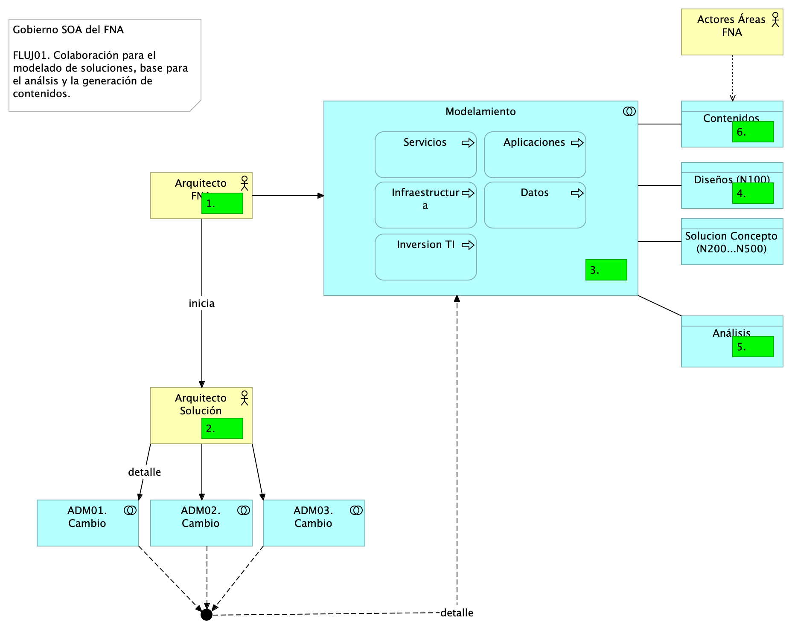
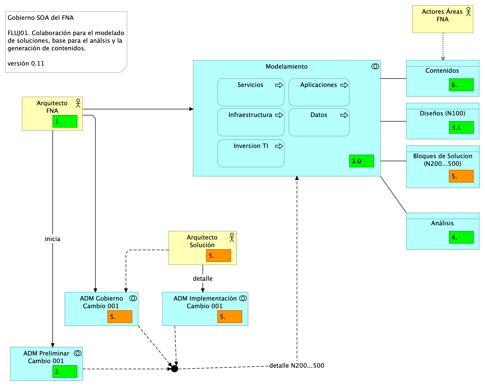

---
geometry:
  - top=1in
  - bottom=1in
fignos-cleveref: True
fignos-plus-name: Fig.
fignos-caption-name: Imagen
tablenos-caption-name: Tabla
...

| Tema           | Modelo de Gobierno SOA. v0.5: **Flujos de Trabajo Oficina de Arquitectura** |
|----------------|--------------------------------------------------------------------------------|
| Palabras clave | SOA, Contexto, Áreas, Procesos, Objetivos, Flujo de trabajo                    |
| Autor          |                                                                                |
| Fuente         |                                                                                |
| Versión        | **1.$COMMIT** del $FECHA_COMPILACION                                           |
| Vínculos       | [Ejecución Plan de Trabajo SOA](onenote:#N001d.sharepoint.com); [Procesos de Negocio FNA](onenote:#N003a.com)|

 

# Flujos de Trabajo Oficina de Arquitectura
Los flujos siguientes han sido definidos para priorizar la atención a los problemas encontrados en el análisis de susceptibilidad de gobierno, PR01.

## Flujo de Trabajo Oficina de Arquitectura Interno
Desarrollamos dos flujos fundamentales de la oficina de arquitectura. El primero, el FLUJ01. Diseño y Análisis de Modelos de Arquitectura del FNA, se ejecuta cada vez que exista una petición de requerimiento de cambio de arquitectura. Los demás pasos de este flujo se resumen a continuación.

1. Recibe el requerimiento de arquitectura
    * Inicia el proceso ADM - Fase de preliminar: alistamiento y aprobación​
    * Arranca el modelado​ inicial o incremental, nivel 100 [^1]
1. El arquitecto de solución continúa el proceso ADM - solicita implementación / gobierno

[^1]: Niveles de detalle de la ingeniería: https://editeca.com/lod-nivel-de-desarrollo/

 

La siguiente imagen ilustra los pasos descritos.

{#fig: width=}

_Fuente: Elaboración propia._

 

## Flujo de Trabajo Oficina de Arquitectura Colaborativo (Proveedores)
Una variante del flujo de trabajo arquitectura ADM, y más sgnificativa para el FNA, incorpora los tipos de análisis que se deben llevar a cabo, como exigencia del gobierno que estamos instalando.

1. El Arq. FNA recibe el requerimientos de cambio
1. Inicia el proceso ADM - fase de preliminar: alistamiento y probación
1. Inicia el modelado
    1. Diseño
        1. Inicia diseño conceptual (nivel 100): appl, datos, TI, servicios, inversión
        1. Bloques de construcción abstractos
    1. Solución
        1. Bloques de construcción de solución
        1. Solicita diseño detallado (nivel 200, 300, 400 o 500) de los dominios de arquitectura: aplicaciones, datos, infraestructura y servicios
1. El Arquitecto FNA inicia los análisis mínimos
    1. Análisis de impacto
    1. de Complejidad
    1. y Costo / beneficio
1. El Arquitecto FNA (de la oficina de arquitectura) solicita al arquitecto de solución, sea de proveedor interno o externo, el inicio del Proceso ADM - fase de implementación y fase de gobierno
    1. El arquitecto de solución modela los bloques de solución [^2]

1. El Arquitecto FNA inicia la creación de contenidos y _documentación técnica_
    
       Nota. Otros análisis exigibles también a los arquitectos de solución: Plan de cambios, Estimación, Estructural.

[^2]: ABB y CBB, TOGAF 9.1. Características generales. En https://pubs.opengroup.org/architecture/togaf9-doc/arch/chap33.html.

## Bloques de Construcción Requeridos por Arquitectura (LAOF)
Los bloques de solución a los que nos referimos en el paso del arquitecto de solución son paquetes de funcionalidad definidos por necesidades de negocio o del arquitecto. Pueden ser cualquier clasificador (objeto tipo) correspondiente al modelo de contenidos de la empresa, como por ejemplo, actores, servicios, aplicaciones, o entidades de datos. Representan un único concepto que tiene límites claros y es reconocible como 'parte' en un dominio de la arquitectura. Puede o no interoperar con otros bloques. Es importante que un bloque de construcción tenga una implementación y un uso. Debe además evolucionar mediante la tecnología. 

Los bloques de solución pueden estar compuesto por otros (ensamblado), y por tanto, puede ser descompuesto (desensamblado) en los bloques pequeños que los constituyen. Es obligatorio que sea reutilizable, reemplazable, y especificado a conformidad.

Los sistemas y herramientas de software de la arquitectura del FNA deben estar creados a partir de colecciones de bloques de solución. De ahí que estos bloques deban tener una interfaz de interacción clara y estable para con otros bloques. 

Lo más importante de estos bloques es que son los que contienen los niveles de detalle (100 al 500). Por ejemplo, a nivel 100, el arquitecto del FNA podría dar comiezo al modelado de un bloque de solución mediante un nombre, una descripción o un esquema. Luego, el arquitecto de solución, puede descomponer este mismo bloque en múltiples construcciones acompañada de una especificación más detallada (nivel 200 al 500).

En la siguiente imagen ilustramos esta variante del flujo de trabajo de la oficina de arquitectura del FNA.

{#fig: width=}

_Fuente: Elaboración propia._

 

