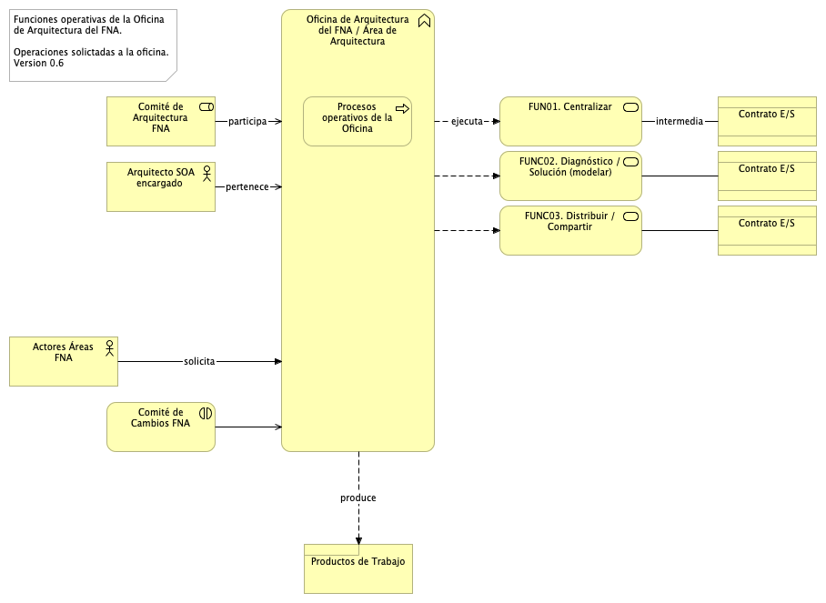
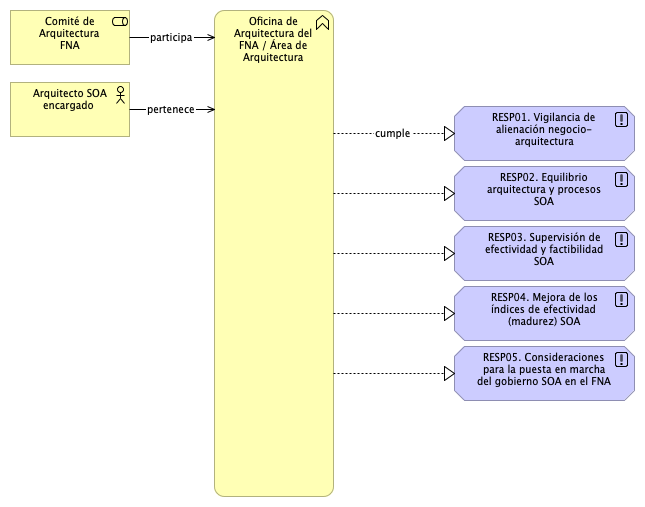

---
geometry:
  - top=1in
  - bottom=1in
fignos-cleveref: True
fignos-plus-name: Fig.
fignos-caption-name: Imagen
tablenos-caption-name: Tabla
...

| Tema           | Modelo de Gobierno SOA. v0.5: **Funciones del Gobierno y Matriz de Responsabilidades** |
|----------------|--------------------------------------------------------------------------------|
| Palabras clave | SOA, Contexto, Áreas, Procesos, Objetivos                                      |
| Autor          |                                                                                |
| Fuente         |                                                                                |
| Versión        | **1.$COMMIT** del $FECHA_COMPILACION                                           |
| Vínculos       | [Ejecución Plan de Trabajo SOA](onenote:#N001d.sharepoint.com); [Procesos de Negocio FNA](onenote:#N003a.com)|

 

# Funciones del Gobierno SOA del FNA
Las funciones que vamos a definir para el gobierno SOA del FNA, entendidas como responsabilidades de la oficina de arquitectura, están dirigidos a las problemáticas encontradas en la Fase I. Estos son, a saber: 

*     Dado los niveles de complejidad que el FNA ha alcanzado y por los riesgos tecnológico que contraen las partes analizadas en la Fase 1 de este diagnóstico (...)
*     De las problemáticas encontradas en la Fase 1 del presente diagnóstico, (...))explícitamente a las que incrementan la complejidad de las soluciones tecnológicas y de software del FNA, _como lo es el manejo de dependencias de los servicios SOA del Fondo_. Es muy conocido que esta condición es la causa de la mayoría de los sobreesfuerzos en los cambios y de las dificultades a la hora de predecir su impacto.
*     (...) Estas complicaciones, que denotan un débil gobierno preexistente, se encuentran otras que fueron levantadas en la Fase 1 del diagnóstico E-Service: - Agilidad limitada, - Complejidad e imprecisión, en la trazabilidad, - Ocultamiento de funcionalidades.

 Ver [Resumen de Fase 1](N03a%a20Vsta%20aSegenta%20SOA%20FNA.md).

 

## Funciones de Gobierno FNA: Oficina de Arquitectura
Las condiciones preexistentes en el FNA indicadas arriba definen el contexto en el cual debe operar, y el que hay que enfrentar con el nuevo gobierno SOA del FNA, versión 0.5. Para enfrentar este contexto requerimos antes lo que llamaremos funciones del gobierno, y que estas sean explícitas para el contexto del FNA. Estas funciones deben tener un corresponsal directo, y este es la oficina de arquitectura del FNA (LOAF), dado que esta es la que las debe ejecutar. Por tanto, el modelo de gobierno FNA, v0.5, propuesto arriba, _viene a jugar el rol del sistema u órgano operativo del que la oficina de arquitectura es el órgano ejectivo de este gobierno_.

Para darle realización a todo el modelo de gobierno (el sistema operativo de la oficina) necesitamos en primer lugar que la oficina funcione de una manera particular. Esto es, la oficina debe ejecutar funciones claras y entregar el resultado de estas a quienes se las solicitan. Vamos a definir tres funcones fundamentales que, desde el gobierno, la oficina de arquitectura del FNA (LOAF) debe realizar con modalidad diaria. 

Estas funciones son operaciones esperadas por aquellos con los que la oficina de arquitectura se relacione. Vienen siendo la interfaz de la oficina expuesta a terceros, y que estos pueden utilizar o requerir de los arquitectos.

{#fig: width=}

_Fuente: Elaboración propia._

 

En la imagen muestra que estas funciones operativas juegan el rol de interfaz de entrada para quien demande una respuesta (salida) de la oficina. Las funciones se complementan de solicitudes específicas que actúan a su vez como contratos de la interfaz de la oficina. Estas funciones se explican se la siguiente manera.

1. Centralizar. La funciónd e centralizar se ocupa de reunir y gestionar la versión única de los productos de trabajo, y de la información, que posee la ofcina. Ejemplo, las decisiones de arquitectura. Es deber del área de arquitectura del FNA centralizar la autoría y gestión de este tipo de infomación. De igual manera se entiende esta función con otro ejemplo o tipo de información a centralizar: los modelos.

1. Diagnosticar / Solución (modelar). La función de diagnósticar y modelar una solución es la función central de la oficina. Se debe a que todos los resultados que la oficina produce están basados en modelos, y en hechos objetivos, alejándose de la habitual intuición y el juicio apresurado.

1. Distribuir (compartir). La función de distribuir (que equivale a la función de compartir) es la gestión de las entrega de los productos de trabajo y resultados de las funciones anteriores.

 

# Responsabilidades de la Oficina de Arquitectura
Las responsabilide que el gobierno del FNA debe exigir, y que la oficina de arquitectura del FNA debe realizar, son:

* RESPC01. Vigilancia de alineación negocio-arquitectura
* RESPC02. Equilibrio arquitectura y procesos SOA
* RESPC03. Supervisión de efectividad y factibilidad SOA
* RESPC04. Mejora de los índices de efectividad (madurez) SOA
* RESPC05. Consideraciones para la puesta en marcha del gobierno SOA en el FNA

 

En una vista de conjunto, presentamos el hecho de que las funciones de gobierno, en tanto que acciones, tenderán a convertirse en las responsabilidades que los integrantes del área de arquitectura del FNA deben cumplir. En la imagen siguiente dejamos explícitos estas responsabilidades.

{#fig: width=}

_Fuente: Elaboración propia._

 

## Vigilancia de alineación negocio-arquitectura

## Equilibrio arquitectura y procesos SOA

## Supervisión de efectividad y factibilidad SOA

## Mejora de los índices de efectividad (madurez) SOA

## Consideraciones para la puesta en marcha del gobierno SOA en el FNA

***
