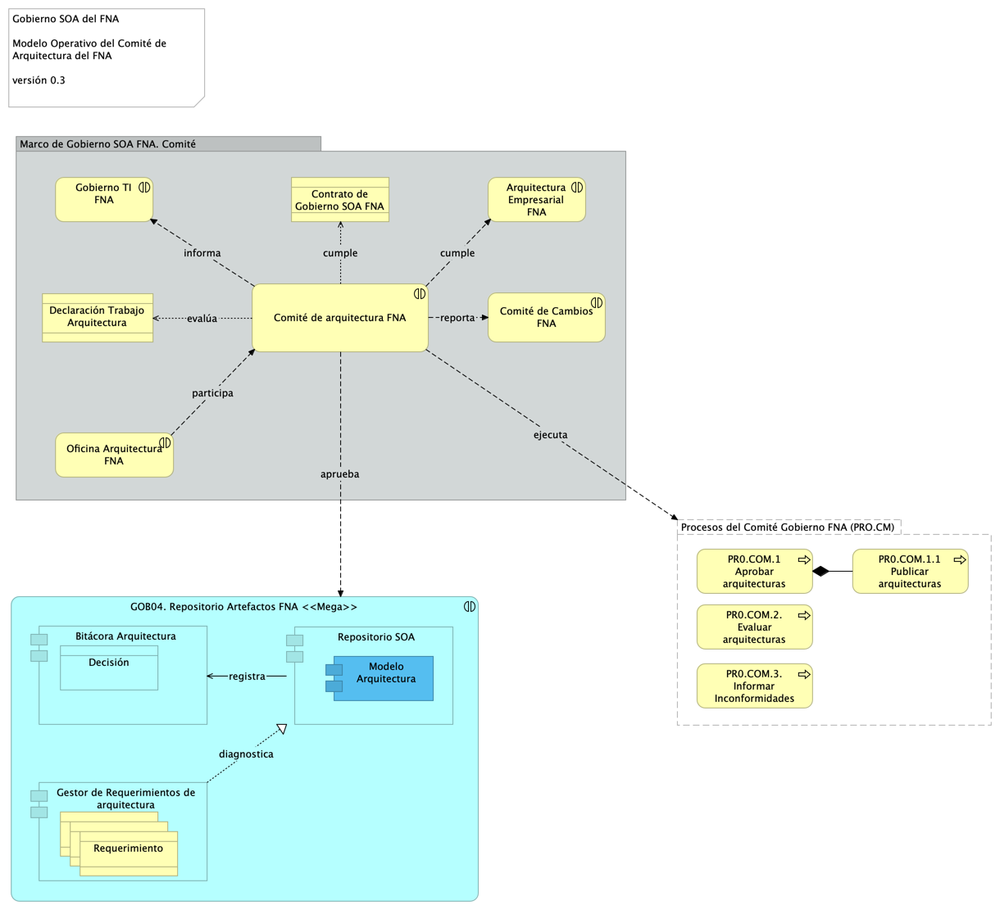

---
geometry:
  - top=1in
  - bottom=1in
fignos-cleveref: True
fignos-plus-name: Fig.
fignos-caption-name: Imagen
tablenos-caption-name: Tabla
...
| Tema           | Comité de Arquitectura del FNA: **Modelo operativo del Comité de Gobierno** |
|----------------|--------------------------------------------------------------------------------|
| Palabras clave | SOA, Comité de arquitectura, Funciones, Responsabilidades, RACI |
| Autor          |                                                                                |
| Fuente         |                                                                                |
| Versión        | **1.$COMMIT** del $FECHA_COMPILACION                                           |
| Vínculos       | [Ejecución Plan de Trabajo SOA](onenote:#N001d.sharepoint.com); [Procesos de Negocio FNA](onenote:#N003a.com)|

 

# El Comité de Arquitectura del FNA
Otro de los instrumentos en donde se materializa el gobierno SOA, objeto de este proyecto, es el comité de revisión y de trabajos de arquitectura. El comité de arquitectura contribuye al gobierno en el sentido de que abarca aspectos de revisión, decisión, seguimiento (en menor grado) y divulgación de trabajos de arquitectura. 

Es de su despacho armonizar los requisitos arquitectónicos macro del FNA, que de otra manera  divergirían o prevalecerían las opiniones en lugar de los criterios. Por esta razón, su principal objetivo (objetivo general) es garantizar que las visiones y los estándares de la oficina de arquitectura estén alineados con el gobierno SOA del FNA, y por ende, con el correcto uso del repositorio de arquitectura del FNA (RAF). 

El la siguiente diagrama resumimos la actuación y colaboración del modelo operativo del Comité de Arquitectura. 

{#fig: width=}

_Fuente: elaboración propia._

 

Es posibilidad del Comité acceder a los modelos, a los que evaluará. Así mismo, debe ponder accder a las capacidades de gestión de requerimientos de arquitectura, y al registro de decisiones en donde consignará sus resoluciones (ver [Funciones del Comité, más adelante](https://stefaninilatam.sharepoint.com/SitePages/Home.aspx)).

## Objetivo Principal del Comité de Arquitectura del FNA (CAF)
El objetivo principal del Comité de Arquitectura del FNA es garantizar que las visiones y los estándares de la oficina de arquitectura estén alineados con el modelo de gobierno SOA del FNA (ver [Modelo de Gobierno y CCF](onenote:#N003a.com)). 

## Objetivos Específicos del CAF
Para alcanzar el objetivo principal, los actores del comité deben perseguir, y gestionar, el logro de los siguientes objetivos específicos y beneficios.

* Guiar y priorización los esfuerzos de la oficina de arquitectura
* Ejercitar los roles y responsabilidades del gobierno SOA del FNA, y respaldar su supervisión y la rendición de cuentas de la oficina de arquitectura
* Efectivizar el proceso de toma de decisiones sobre los trabajos de arquitectura
* Verificar la aplicación de los métodos (procedimientos normales) de arquitectura del FNA y del gobierno SOA del FNA
* Fomentar el uso de herramientas de publicación automatizable por audiencia de los puntos de vista de los trabajos de arquitectura
El valor empresarial ampliado y elevado de la arquitectura en toda la empresa
* Procurar la visibilidad de las áreas del FNA del trabajo de la oficina de arquitectura 

 

## Funciones del Comité
El comité de arquitectura tiene dos funciones básicas. Es decir, lo que se espera que el comité responda es: 
1. FUNC10. Dirimir (decisiones)
1. FUNC11. Divulgar (resoluciones)
1. FUNC13. Evaluación (arquitecturas)

### Función de Dirimir (FUNC11)
El Comité debe proporcionar herramientas y contar con métodos precisos para avalar una decisión de arquitectura sobre otra. Además, en arreglo al principio de paridad y ponderación, las decisiones de arquitectura no pueden generar ventajas a terceros por los diseños propuestos.

Esta función debe ejecutarse en modalidad eventual: cuando en la llegada de un trabajo de arquitectura, la Oficina determina que requiere una sesión del Comité (CAF) para acordar una solución de carácter impactante para la empresa. Las condiciones de impactante, están relacionadas con los análisis primarios de complejidad, impacto y costo/beneficio descritos en el modelo operativo de este gobierno, objeto del proyecto.

### Función de Divulgar (FUNC12)
Esta función tiene dos modalidades. Primero, la de evidenciar. El Comité (CAF) debe evidenciar, en todo momento, las consideraciones y soportes que condujeron a las conclusiones tras una decisión de arquitectura. Para esto, es fundamental la Bitácora de Decisiones, capacidad que debe procurar el repositorio de arquitectura del FNA, de cuya efectividad se desprende la característica de relacionamiento entre bloques de construcción de los modelos (ver [Bloques de Construcción Requeridos por Arquitectura, en Flujos de Trabajo Oficina de Arquitectura](onenote:#N003a.com)).

Esta función debe con frecuencia eventual: cuando le sea requerido por la Vicepresidencia de Tecnología del FNA.

La segunda modalidad de esta función es la de comunicar. El Comité (CAF) debe reunir a las partes interesadas en conocer los avances teóricos, prácticos y metológicos que considere pertinentes que la empresa conozca.

Esta función debe con frecuencia periódica trimestral: cada 3 meses.

### Función de Evaluar (FUNC13)
El Comité debe mantener y aplicar métodos de evaluación de arquitectura actualizados y particularizados según los aspectos de esta a evaluar: Estandarización, Cohesión, Reutilización y Retorno de Beneficio (ver [Políticas de la Oficina de Arquitectura del FNA](https://stefaninilatam.sharepoint.com/SitePages/Home.aspx)).

Esta función debe ejecutarse con frecuencia periódica mensual.

 

