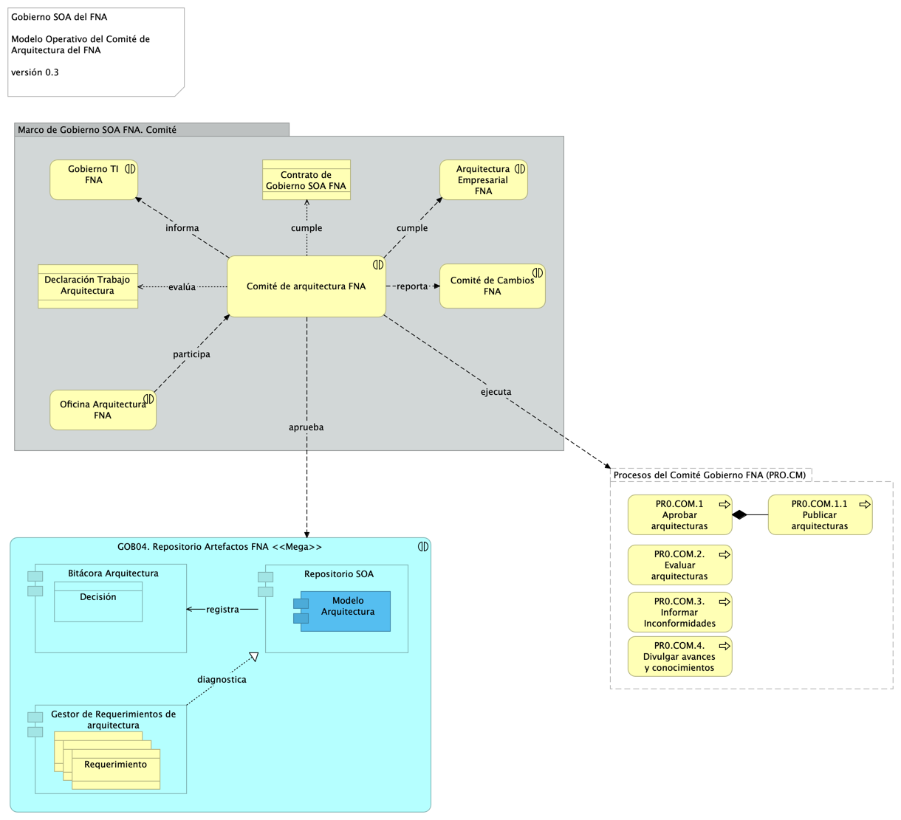

\newpage

| Tema           | Comité de Arquitectura del FNA: **Descripción del Comité de Gobierno de Arquitecturas del FNA** |
|----------------|--------------------------------------------------------------|
| Palabras clave | SOA, Comité arquitectura, Procesos, Objetivos, Modelo        |
| Autor          |                                                              |
| Fuente         |                                                              |
| Versión        | **1.$COMMIT** del $FECHA_COMPILACION                         |
| Vínculos       | [Ejecución Plan de Trabajo SOA](onenote:#N001d.sharepoint.com); [Procesos de Negocio FNA](onenote:#N003a.com)|

 

# Modelo operativo del Comité de Arquitectura del FNA
A partir del modelo inicial del Comité descrito en [Descripción del Comité de Gobierno de Arquitecturas del FNA](<../../fna-dd-f2-e1/content/03n.1.descripcion comite.md>), en esta sección ampliaremos detalles de los conceptos oprativos y de la puesta en marcha del Comité dentro del FNA. 

Partimos de la definición de Comité de Arquitectura enunciada para el FNA.

    El Comité de Arquitectura del FNA (CAF) materializa el gobierno SOA. Lleva a cabo los procesos de aprobación de las arquitecturas y contribuye al gobierno al realizar tareas de revisión, decisión, seguimiento (en menor grado) y divulgación de trabajos de arquitectura. 

De esta definición destacamos el rol clave que el Comité juega para el gobierno y describiremos los procesos operativos que este debe realizar y que lo constituyen como tal.

## Procesos del Comité de Arquitectura FNA (CAF)
Para cumplir sus objetivos y funciones (ver [Objetivos Específicos del CAF](<04.a1.modelo comite.md>) debemos definir los procesos que este debe realizar.

El Comité realiza los procesos siguientes
1. Aprobar y publicar las arquitecturas resultantes (sean reformas, adaptaciones, migraciones, o arreglos), 
1. Evaluar las arquitecturas resultantes y la adherencia a la arquitectura de referencia
1. Determinar las acciones que los interesados de las nuevas arquitecturas, o sus transiciones, deben conocer para la corrección de las inconformidades

 

El la siguiente diagrama resumimos la actuación y colaboración del modelo operativo del Comité de Arquitectura. 

{#fig: width=}

_Fuente: elaboración propia._

 

## Conformación del Comité para el Gobierno SOA del FNA
El equipo de trabajo requerido conforme el modelo de gobierno SOA presentado aquí se compone del capital humano en los roles de gestión de la tecnología y arquitectura en los ámbitos de diseño de servicios SOA y componentes de software, infraestructura tecnológica y redes, aplicaciones de solución y herramientas de software, y del especialista de las estructuras de datos e información del negocio. Estos recursos deben ser preferiblemente propios de la organización (no terceros) debido a la gestión de conocimiento del _activo más importante del gobierno SOA, la arquitectura de referencia y los vínculos de esta con los contextos de negocio y TI_.

[Imagen 2.]() Roles y Grupos de trabajo del gobierno SOA del FNA.

_Fuente: elaboración propia._

 