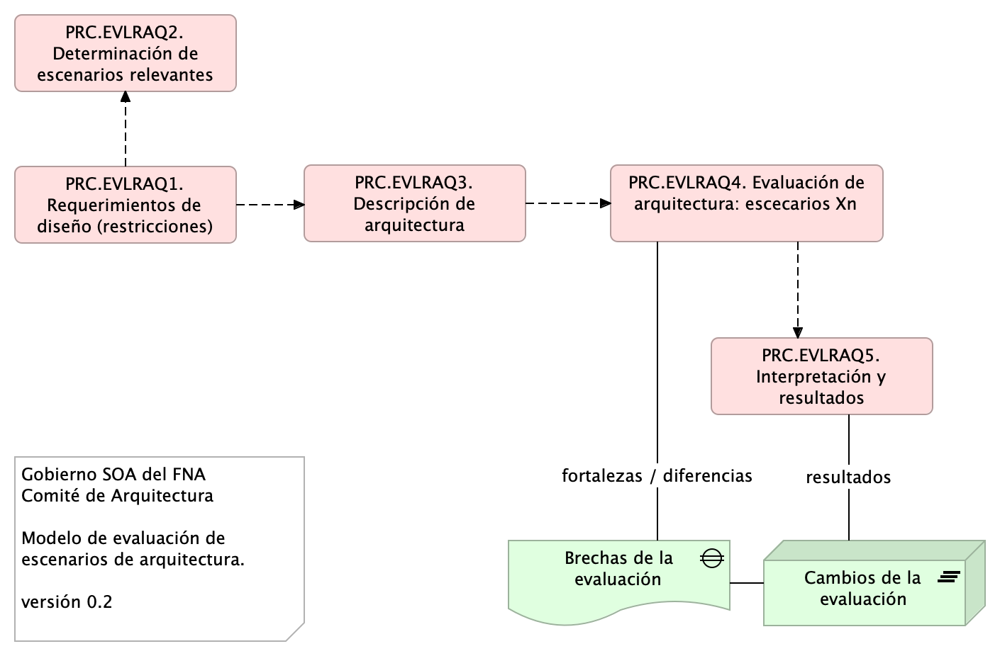

\newpage

| Tema           | Gobierno SOA del FNA: **Método de evaluación de arquitecturas para el FNA**  |
|----------------|------------------------------------------------------------------------|
| Palabras clave | SOA, Evaluación de arquitectura, ATAM, Método  |
| Autor          |                                                |
| Fuente         |                                                |
| Versión        | **1.$COMMIT** del $FECHA_COMPILACION           |
| Vínculos       | [Ejecución Plan de Trabajo SOA](onenote:#N001d.sharepoint.com); [Procesos de Negocio FNA](onenote:#N003a.com) |

 

# Método de Evaluación de Arquitecturas para el FNA (EVALF)
La evaluación arquitectónica es la máxima en el cumplimiento tanto del Gobierno SOA del FNA, versión 0.6 (incluye riesgos técnicos) como de la misión del propio Comité de Arquitectura del Fondo (CAF). Este ejercicio, de realizarse reduce el esfuerzo y los costos de desarrollo de las soluciones de servicios y software, y guarda la calidad al verificar la dirección y sentido de los requisitos y al identificar los riesgos potenciales. 

El objetivo de los evaluadores (arquitectos de la oficina, normalmente) proporcionen garantías a los ingenieros, desarrolladores, proveedores y fábricas de software del FNA de que la arquitectura elegida cumplirá con los requisitos de calidad, tanto funcionales como no funcionales. 

    La evaluación de arquitectura, como está definida aquí, proporcione garantías a los ingenieros, desarrolladores, proveedores y fábricas de software del FNA de que el diseño elegido cumplirá con los requisitos de calidad funcionales y sistémicos (no funcionales).

    Importante. Una máxima de la evaluación de arquitectura es que debe traer más beneficios que costos.

En este aparte desarrollaremos el método de evaluación de arquitecturas acondicionado para la Oficina y el Comité de Arquitectura (CAF) del Fondo, tal que cumpla con las características determinadas en ([Características del Método de Evaluación de Arquitecturas](../../fna-dd-f2-e1/content/03n.3.evaluacion.md)) para esta herramienta.

Las características que el método de evaluación debe cumplir son las indicadas en la siguiente table.

| **1. Organización** |                                                          |
|---------------------|----------------------------------------------------------|
|                     | 1. Riesgos técnicos                                      |
|                     | 2. Puntos de Sensibilidad al Cambio                      |
|                     | 3. Compensaciones                                        |
|                     | 4. Costo / Beneficio                                     |
|                     |                                                          |
| **2. Elementos**    |                                                          |
|                     | 1. Escenarios de calidad                                 |
|                     | 2. Sistema de puntuación                                 |
|                     | 3. Árbol de utilidad (diversificación)                   |

Table: Características que cumple el método de evaluación de arquitectura (MEVFNA) seleccionado para el FNA. {#tbl:atam-id}

 

# Evaluación de Arquitecturas FNA Basada en Escenarios (ASAM)
La evaluación por escenarios (ASAM, por sus siglas en inglés) basado en ATAM del Open Group, ofrece una manera efectiva (en comparación con otros métodos [^evalcomp]) de encontrar el valor de aptitud de una arquitectura de servicios o de software respecto a atributos de calidad competitivos. 

[^evalcomp]: Software Architecture Evaluation Methods – A survey. P. Shanmugapriya, Research Scholar, Department of CSE, SCSVMV University, Enathur, Tamilnadu, INDIA

El principal valor de la evaluación por escenarios es contestar de manera sistemática la pregunta de control: ¿puede esta arquitectura o no ejecutar este escenario? La evaluación debe determinar los componentes de la arquitectura implicados en el resultado a favor o no de la pregunta de control. Si la arquitectura falla en el propósito de ejecutar el escenario, es obligatorio del método dar parte de la lista de cambios en la arquitectura que sean requeridos para soportarlo, y por supuesto, estimar su costo/beneficio. 

    Importante. El valor de la evaluación por escenarios es contestar de manera sistemática la pregunta de control: ¿puede esta arquitectura o no ejecutar este escenario?, y estimar el costo/beneficio del cambio.

El método por escenarios, ASAM, ayuda además a encontrar _arquitecturas candidatas_, o cambios interesantes sobre una arquitectura ejecutable. Las arquitecturas o cambios candidatos se describen en términos de los elementos arquitectónicos de interés (componentes de la arquitectura, o del software) para cada uno de los atributos de calidad. 

En la siguiente ilustración resumimos las acciones y relaciones que este método requiere.

{#fig: width=}

_Fuente: elaboración propia._

 

Los atributos de calidad de sistemas que pueden usarse como referencia para el método propuesto de evaluación son los indicados en la imagen siguiente.

{#fig: width=}

_Fuente: elaboración propia._

 

Al final, el método propuesto debe entregar información accionable y de soporte de decisiones y planeación para la actualización/o no, de la plataforma tecnológica del SIAFP.

## Proceso de Evaluación Basado en Escenarios (ASAM)
Descripción del modelo de evaluación propuesto.

Para la evaluación de arquitectura y proveedores utilizaremos el proceso sugerido por los métodos de basados en escenarios. En este tipo de procesos la parte central es la selección y elaboración de los escenarios tanto técnicos como de negocio.

### 0. Descripción de escenarios directos
La descripción de escenarios se la realizará mediante un diagrama dinámico de flujo de trabajo. Ejemplo.

{#fig: width=}

_Fuente: ASAM. Department of CSE, SCSVMV University._

### 0.1. Priorización de escenarios
La priorización de escenarios se la realizará por votación. La votación estará a cargo de los  arquitectos de la Oficina FNA.

{#fig: width=}

_Fuente: ASAM. Department of CSE, SCSVMV University._

### 1. Evaluación de escenarios
Para la evaluación de los escenarios se utilizará una variante del método cualitativo. Los criterios de la evaluación se basarán en la criticidad del riesgo del componente, en lugar, de cantidad de componentes, indicada en el siguiente ejemplo.

{#fig: width=}

_Fuente: ASAM. Department of CSE, SCSVMV University._

### 2. Comparación de escenarios
**Nota**. Por cada arquitectura se evalúan los mismos escenarios.

Si por cada requerimiento de negocio/técnico, se obtienen varios escenarios, se realizará la comparativa de puntos entre los escenarios donde el mejor puntaje gana. El sistema de puntuación para los escenarios es el propuesto a continuación.

{#fig: width=}

_Fuente: ASAM. Department of CSE, SCSVMV University._

### 3. Salidas del Proceso de Evaluación
* SAL01. Análisis de Sensibilidad: Decisiones de arquitectura que impacta positivamente al negocio.
* SAL02.  Mapa de Riesgos Arquitectónicos: Son aquellos para los que no hay valor satisfactorio como respuesta a una acción desde un enfoque arquitectónico.
* SAL03.  Lista de Conformidades (no-riesgos)
* SAL04.  Resultado del Cuestionario de evaluación (respuestas a preguntas de análisis)

 
