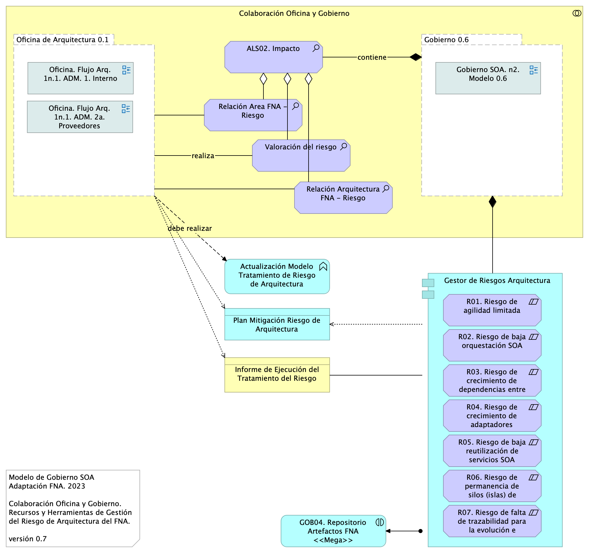

|Tema            |Gobierno SOA: **Métodos para el tratamiento de los riesgos técnicos** |
|----------------|---------------------------------------------------|
|Palabras clave|SOA, Gobierno, Riesgo, Objetivos de negocio|
|Autor||
|Fuente||
|Versión|**$COMMIT** del $FECHA_COMPILACION|
|Vínculos|[Fase 2 PR6 Gobierno SOA](N03a%a20Vsta%20aSegenta%20SOA%20FNA.md)|

 

# Tratamiento de los Riesgos de Arquitectura del FNA
Organizados como estamos bajo la definición de riesgo de arquitectura adoptada en este proyecto, que en resumen establece que el riesgo de arquitectura es una amenaza, vulnerabilidad e impacto negativo a los objetivos y al trabajo de la Oficina de Arquitectura del FNA, y con los objetivos de Gobierno SOA 0.6 del FNA, dotaremos al modelo de gobierno, versión 0.5, de las capacidades, recursos y roles, funciones y procedimientos para medir y gestionar los riesgos.

## Gobierno SOA del FNA con Gestión de Riesgos de Arquitectura (versión 0.6)
La versión 0.6 del Gobierno realizará el tratamiento de las áreas de riesgo R1 a R7 sumando la capacidad de registro de riesgos del repositorio de arquitectura (Gestor de riesgo, en la gráfica). 

{#fig: width=}

_Fuente: elaboración propia._

 

El modelo de gobierno 0.6 agrega además al repositorio de análisis los pertinentes a la gestión de riesgos del FNA:

1. Relación Área FNA - Riesgo
1. Valoración del riesgo
1. Relación Arquitectura FNA - Riesgo

 

## Oficina de Arquitectura con Gestión de Riesgos
Al igual que hicimos con el gobierno SOA, que al incorporar la gestión de riesgos pasa a ser versión 0.6, ahora haremos lo propio para la Oficina de Arquitectura del FNA. Debemos dotar al flujo de trabajo de esta con las capacidades, recursos y roles, funciones y procedimientos para medir y gestionar los riesgos.

{#fig: width=}

 

El modelo de colaboración muestra cómo la Oficina y el Gobierno 0.6 se relacionan mutuamente mediante los conceptos y artefactos que son dictados por el gobierno y ejecutados por la oficina de arquitectura (versión 0.1). Estos ítems de colaboración se listan en la columna del centro del diagrama, y _son la base fundacional del tratamiento de los riesgos_ técnicos de arquitectura con los que complementan además y mejoran al gobierno del FNA.

