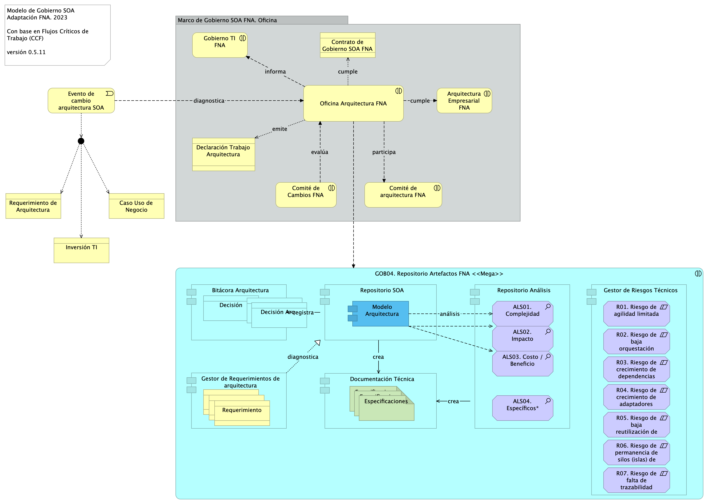

|Tema            |Gobierno SOA: **Riesgos tecnológicos del FNA** |
|----------------|---------------------------------------------------|
|Palabras clave|SOA, Gobierno, Riesgo, Objetivos de negocio|
|Autor||
|Fuente||
|Version|**$COMMIT** del $FECHA_COMPILACION|
|Vínculos|[Fase 2 PR6 Gobierno SOA](N03a%a20Vsta%20aSegenta%20SOA%20FNA.md)|

 

# Tratamiento a los Riesgos Tecnológicos del FNA

 

### Gobierno SOA y Riesgos Tecnológicos del FNA
El gobierno SOA del FNA debe buscar la capacidad para medir y gestionar (agregar a la lista de riesgos de la empresa) los riesgos que lo están afectando.

* R1. Riesgo de agilidad limitada (ver imagen 1)
* R2. Riesgo de baja orquestación SOA (ver imagen 2a y 2b)
* R3. Riesgo de crecimiento de dependencias entre servicios SOA
* R4. Riesgo de crecimiento de adaptadores particulares --opuesto al estándar-- (ver imagen 3)
* R5. Riesgo de baja reutilización de servicios SOA
* R6. Riesgo de permanencia de silos (islas) de servicios SOA y aplicaciones
* R7. Riesgo de falta de trazabilidad para la evolución e implementación de los servicios SOA

 

{#fig: width=}

_Fuente: Diagnóstico SOA. E-Service (2022)._

 
