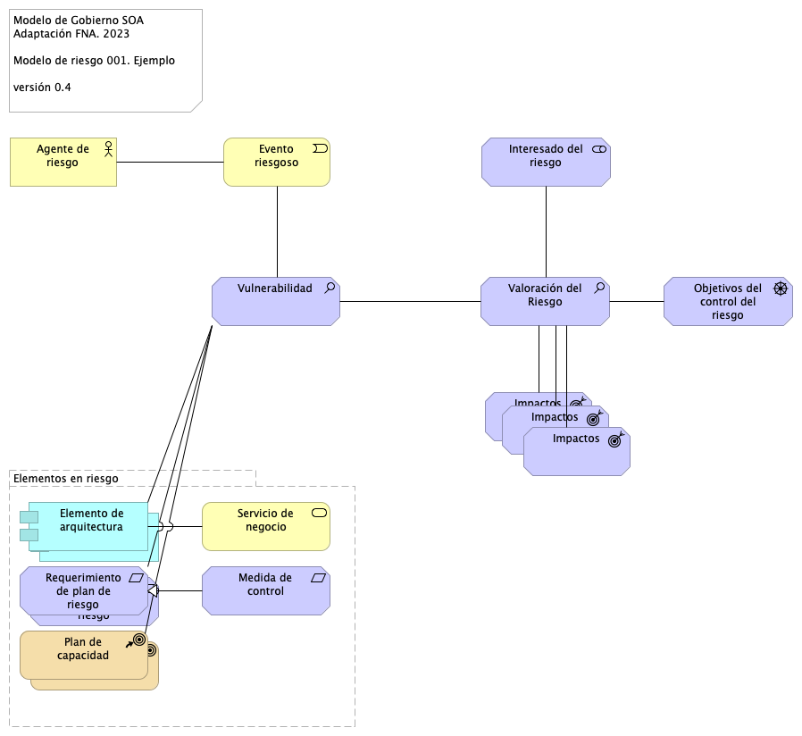

| Tema           | Gobierno SOA del FNA: **Modelamiento del Riesgo Técnico de Arquitectura del FNA** |
|----------------|---------------------------------------------------------------|
| Palabras clave | SOA, Riesgo técnico, Modelo, Arquitectura                     |
| Autor          |                                                               |
| Fuente         |                                                               |
| Versión        | **1.$COMMIT** del $FECHA_COMPILACION                          |
| Vínculos       | [Ejecución Plan de Trabajo SOA](onenote:#N001d.sharepoint.com); [Procesos de Negocio FNA](onenote:#N003a.com)|

 

# Técnica para Modelar Riesgos de Arquitectura para el FNA
Para completar el cumplimiento del objetivo de manejo de riesgos del Gobierno SOA del FNA, versión 0.6, y de dotar a la oficina de arquitectura de los recursos para cumplir tal objetivo, desarrollamos a continuación las consideraciones para modelar en el repositorio de arquitectura los riesgos de la arquitectura, lo cual contribye de gran manera a la gestión y tratamiento de los mismos.

## Correspondencia de Conceptos del Riesgo y Arquitectura
Es fundamental establecer una correspondencia de conceptos con el "mundo" y el lenguaje de modelado, que en el caso de la arquitectura es ArchiMate 2.1 (o superior). La siguiente tabla presenta una posible correspondencia entre los conceptos del riesgo técnico de la arquitectura y el lenguaje indicado.

 

| Correspondencia | Concepto real           | Concepto Archimate       |
|-----------------|------------------------ |--------------------------|
|  1.             | Riesgo                  | Outcome                  |
|  2.             | Amenaza                 | Assessment               |
|  3.             | Vulnerabilidad          | Assessment               |
|  4.             | Impacto                 | Outcome                  |
|  5.             | Activo / ítem           | Resource, Core Element   |
|  6.             | Agente riesgo           | Active Structure Element |
|  7.             | Evento riesgoso         | Business Event           |
|  8.             | Securidad.Meta          | Goal                     |
|  9.             | Securidad.Resultado     | Outcome                  |
|  10.            | Securidad.Principio     | Principle                |
|  11.            | Securidad.Requerimiento | Requirement              |
|  12.            | Securidad.Cumplimiento  | Requirement              |
|  13.            | Securidad.Control       | Requirement              |
|  14.            | Securidad.Measure       | Requirement              |
|  15.            | Securidad.Constraint    | Constraint               |
|  16.            | Riesgo.auditor          | Stakeholder              |
|  17.            | Riesgo.analista         | Stakeholder              |
|  18.            | Riesgo.asesor           | Stakeholder              |
|  19.            | Security Resource       | Architect                |
|  20.            | Security Service        | Capability               |
|  21.            | Security Capability     | Service                  |

Table: Correspondencia de Conceptos del Riesgo del Gobierno SOA del FNA, versión 0.6. {#tbl:riesgo1-id}

## Referencia para Modelar el Riesgo de Arquitectura del FNA
La idea central del modelamiento de los riesgos de arquitectura es darle alguna respuesta a las siguientes preguntas de control respecto a cada eventos de riesgo o amenaza que problematice las funciones de la Oficina de Arquitcuta del FNA.

Ante un evento riesgoso o amenaza el modelo busca responder las siguientes preguntas de control.

1. ¿Qué puede salir mal en la operación existente?
1. ¿Qué hacer para darle tratamiento a esta amenaza?
1. ¿Qué activos/ítems o sistemas debemos proteger?
1. ¿Qué sistema (aplicación, sistema o componente) será impactado, y en qué medida?

 

A continuación presentamos la propuesta de uso y organización de los conceptos generales para el modelamiento de los riesgos de arquitectura del FNA. 

{#fig: width=}

_Fuente: elaboración propia._

 

Podemos comprobar la efectividad del modelo de riesgo relacionándolo con las pregunta de control consignadas arriba. En la siguiente ilustración mostramos cómo el modelo responde a estas preguntas.

{#fig: width=}

_Fuente: Diagnóstico SOA. E-Service (2022)._

 

    Importante: Para todos los riesgos, la herramienta de implementación del repositorio de arquitecrtura del FNA (que para el proyecto es Mega) debe tener la capacidad de generar la documentación técnica del riesgo a partir de su modelo. 

## Modelo Simple de Riesgo de Arquitectura
Desarrollamos un modelo de riesgo tomando como entrada un caso particular del FNA descrito anteriomente.

{#fig: width=}

_Fuente: elaboración propia._

 

Para la identificación y trazabilidad del estado de un riesgo necesitamos etiquetar con una identificación única a cada riesgo gestionado. En el modelo que presentamos el identificador es el 001.

    Importante: Para todos los riesgos, la herramienta de implementación del repositorio de arquitecrtura del FNA (que para el proyecto es Mega) debe tener la capacidad de generar la documentación técnica del riesgo a partir de su modelo. 

 

Blah blah [@doe99; @smith2000; @smith2004].
