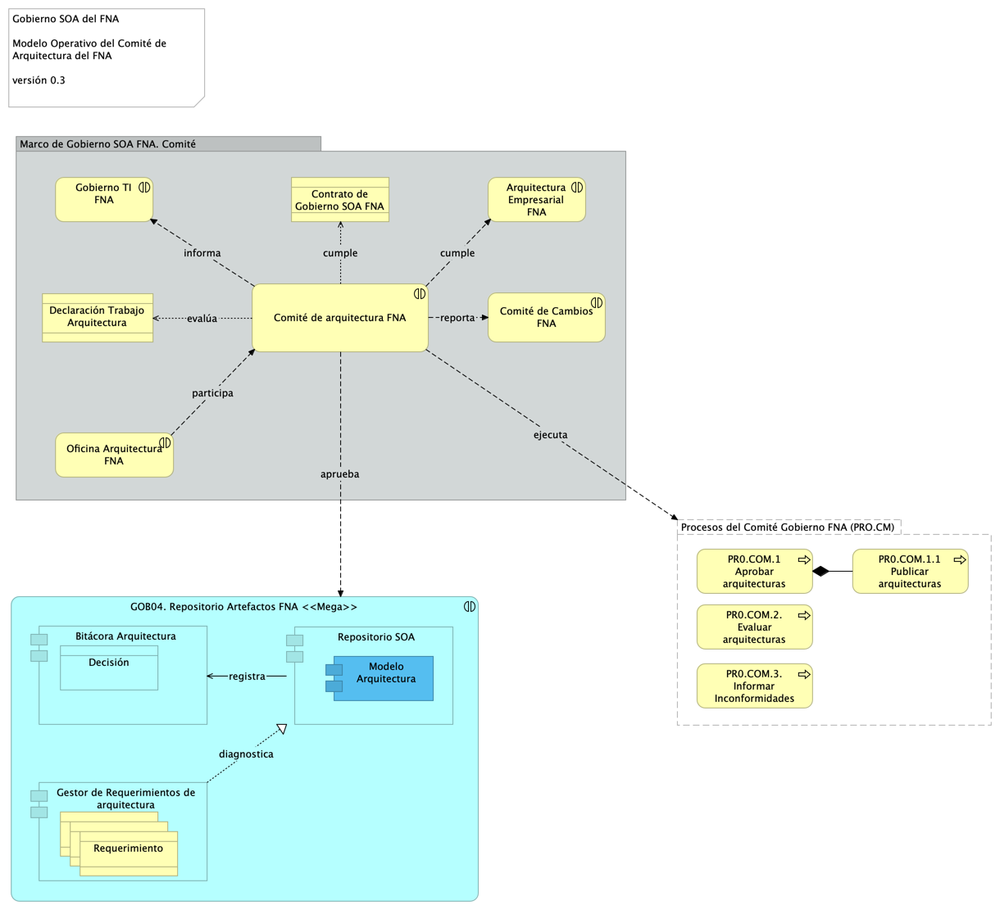
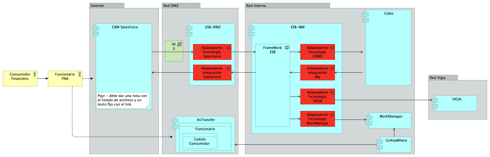
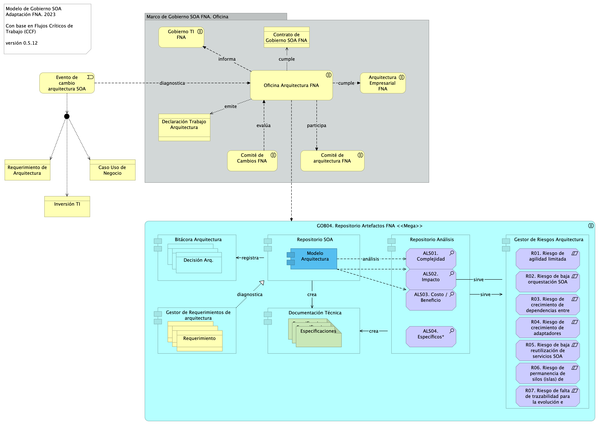
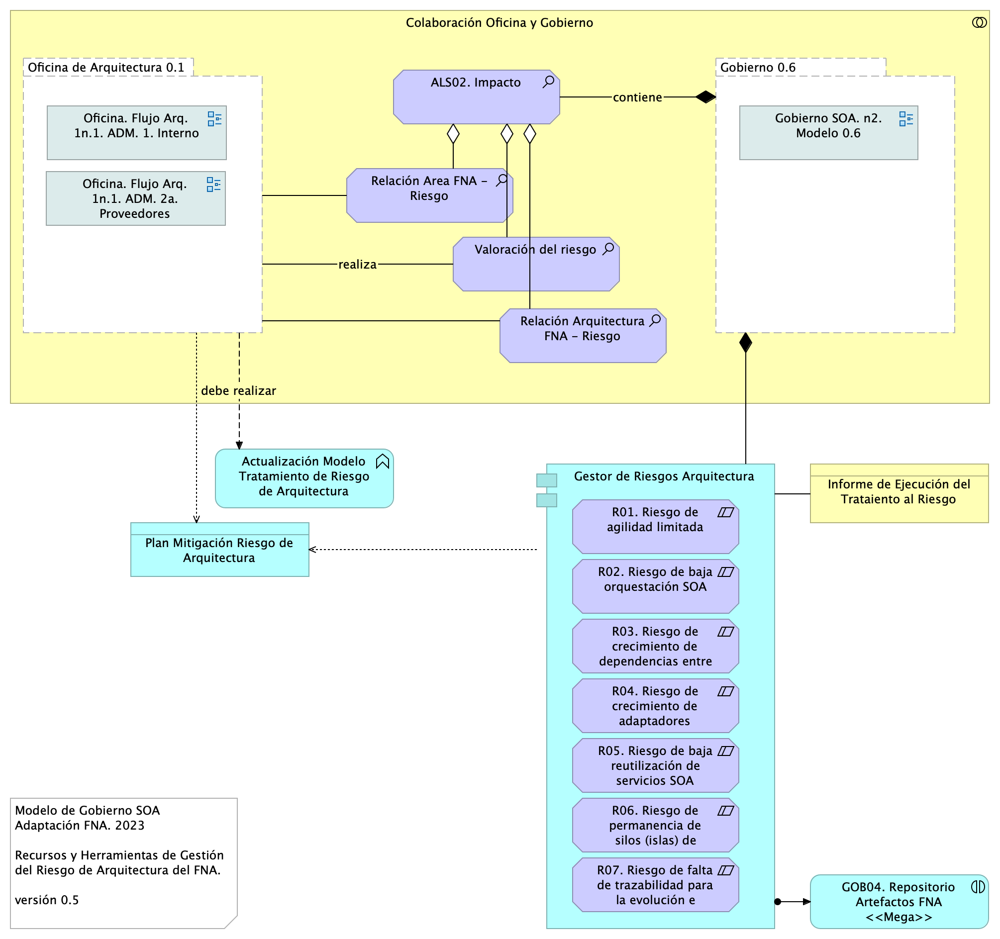
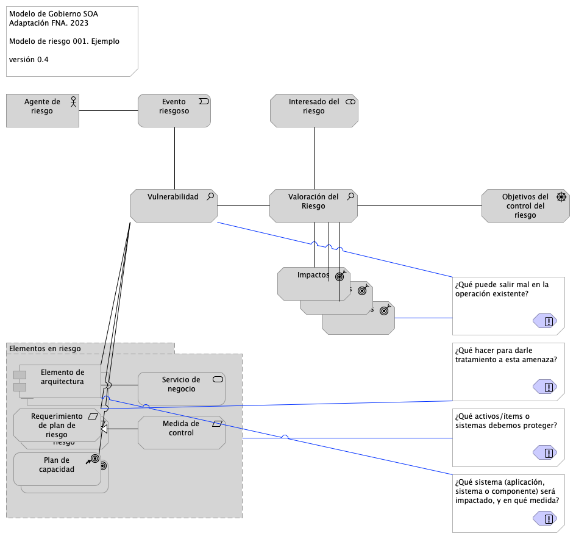
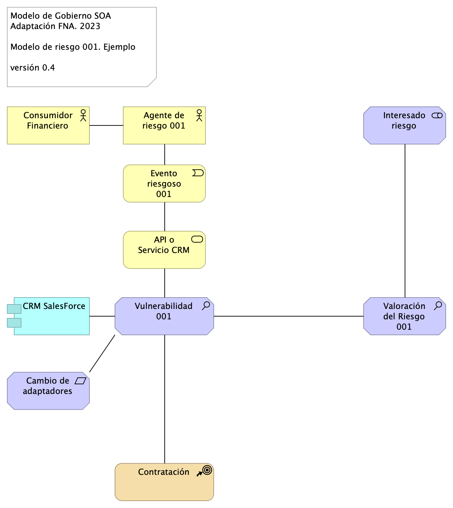

geometry:
  - top=1in
  - bottom=1in
fignos-cleveref: True
fignos-plus-name: Fig.
fignos-caption-name: Imagen
tablenos-caption-name: Tabla
...

\newpage

>    E-Service. Fase II
>
>    PRY01. Gobierno SOA del FNA. Contenido de los Productos Contractuales
>
>    Contrato 1812020
>
>    FNA, Stefanini
>
>    04 Jul 2023
>
>    **Versión** 1.8976b67

 

# Producto 4: PR04. Definición de roles y responsabilidades e instalación del comité
Desarrollo de procedimientos, funciones, entregables, selección de roles y herramientas a desplegar para la puesta en marcha de un Comité de Arquitectura del FNA adscrito a la Vicepresidencia de Tecnología FNA y en cumplimiento con el Gobierno SOA, versión 0.5, objeto de este proyecto.

**Nota**: los análisis de este producto están dirigidos a cumplir los objetivos del proyecto PRY01, Gobierno SOA: desarrollo, gestión, gobierno de arquitectura y adopción.

 

## Justificación
El Comité de Arquitectura es la entidad de supervisión ubicada entre la oficina de arquitectura (PR02, objeto de este proyecto) y los líderes de grupo de productos del FNA y áreas interesadas. Es una figura necesaria dado los resultados de los diagnósticos SOA, en particular el de riesgos técnicos, realizados en la Fase I de la consultoría E-Service que señalan como causantes a la complejidad y (baja) agilidad que enfrenta el FNA. El Comité de Arquitectura funge como complemento, apoyo y arbitraje (directriz) de los decisiones conciernentes a los trabajo de arquitectura del FNA dirigidos a la solución de estos problemas.

## Contenidos
1. Modelo operativo del Comité de Gobierno de Arquitectura del FNA: actores, información y procedimientos
1. Consideraciones para la puesta en marcha del Comité
1. Soporte a la Oficina de Arquitecura (Pr02) y a la Vicepresidencia de Tecnología del FNA
1. Matriz de responsabilidades y procedimiento del Comité de Arquitectura
1. Métodos de evaluación de arquitecturas para el FNA

 

## Criterios de Aceptación
* Entendimiento funcional y operativa del comité de arquitectura del FNA
* Matriz de roles y procedimientos del del comité de  arquitetura del FNA

 

## Modelo de Implementación del PRY01
{#fig: width=lin}

_Fuente: Elaboración propia._

Blah blah [soton403913].

 

\newpage

| Tema           | Comité de Arquitectura del FNA: **Descripción del Comité de Gobierno de Arquitecturas del FNA** |
|----------------|--------------------------------------------------------------|
| Palabras clave | SOA, Comité arquitectura, Procesos, Objetivos, Modelo        |
| Autor          |                                                              |
| Fuente         |                                                              |
| Versión        | **1.8976b67** del 04 Jul 2023                         |
| Vínculos       | [Ejecución Plan de Trabajo SOA](onenote:#N001d.sharepoint.com); [Procesos de Negocio FNA](onenote:#N003a.com)|

 

# Modelo operativo del Comité de Arquitectura del FNA
A partir del modelo inicial del Comité descrito en [Descripción del Comité de Gobierno de Arquitecturas del FNA](<../../fna-dd-f2-e1/content/03n.1.descripcion comite.md>), en esta sección ampliaremos detalles de los conceptos oprativos y de la puesta en marcha del Comité dentro del FNA. 

Partimos de la definición de Comité de Arquitectura enunciada para el FNA.

    El Comité de Arquitectura del FNA (CAF) materializa el gobierno SOA. Lleva a cabo los procesos de aprobación de las arquitecturas y contribuye al gobierno al realizar tareas de revisión, decisión, seguimiento (en menor grado) y divulgación de trabajos de arquitectura. 

De esta definición destacamos el rol clave que el Comité juega para el gobierno y describiremos los procesos operativos que este debe realizar y que lo constituyen como tal.

## Procesos del Comité de Arquitectura FNA (CAF)
Para cumplir sus objetivos y funciones (ver [Objetivos Específicos del CAF](<04.a1.modelo comite.md>) debemos definir los procesos que este debe realizar.

El Comité realiza los procesos siguientes
1. Aprobar y publicar las arquitecturas resultantes (sean reformas, adaptaciones, migraciones, o arreglos), 
1. Evaluar las arquitecturas resultantes y la adherencia a la arquitectura de referencia
1. Determinar las acciones que los interesados de las nuevas arquitecturas, o sus transiciones, deben conocer para la corrección de las inconformidades
1. Divulgar conocimientos de arquitectura, entendidos como diseño, soluciones, prácticas y herramientas a los ingenieros e interesados del FNA

 

El la siguiente diagrama resumimos la actuación y colaboración del modelo operativo del Comité de Arquitectura. 

{#fig: width=}

_Fuente: elaboración propia._

 

## Conformación del Comité para el Gobierno SOA del FNA
El equipo del trabajo del CAF requerido, conforme el modelo de gobierno SOA presentado en este proyecto, se compone de los roles de gestión de la tecnología y arquitectura en los ámbitos de diseño de servicios SOA y componentes de software: arquitecto SOA, o quien haga las veces de este); infraestructura tecnológica y redes: arquitecto de TI; aplicaciones de solución y herramientas de software: arquitecto de aplicaciones; y del especialista de las estructuras de datos e información del negocio: arq. de datos.

[Imagen 2.]() Roles y Grupos de trabajo del gobierno SOA del FNA.

_Fuente: E-Service, Fase I (2022)._

 

Estos recursos deben funcionar como recursos propios de la organización, sin perjuicio de que sean externos. Lo anterior, debido a la gestión de conocimiento del _activo más importante del gobierno SOA: las arquitecturas SOA y la arquitectura de referencia 2.0 del FNA, junto a los vínculos de estas con los contextos de negocio y TI_.

La evaluación de arquitectura queda ordenada en 3 aspectos:
1. Riesgos técnicos
2. Puntos de Sensibilidad
3. Compensaciones

Mecánica
1. Elaboración de escenarios (Arq.)
2. Evaluación de escenarios (Eval.)
3. Calificación del árbol utilidad (Arq.)

Escenarios
* operaciones más usadas en el negocio: cuáles son?

---
geometry:
  - top=1in
  - bottom=1in
fignos-cleveref: True
fignos-plus-name: Fig.
fignos-caption-name: Imagen
tablenos-caption-name: Tabla
...

\newpage

>    E-Service. Fase II
>
>    PRY01. Gobierno SOA del FNA. Contenido de los Productos Contractuales
>
>    Contrato 1812020
>
>    FNA, Stefanini
>
>    04 Jul 2023
>
>    **Versión** 1.8976b67

 

# Producto 5: PR05. Procesos de mejoramiento de diseño y vigilancia de riesgos técnicos
Uno de los principales valores que un Gobierno entrega es la identificación y la gestión de las acciones para controlar los riesgos. Y en el caso de este ejercicio de gobierno trataremos los riesgos de tecnología y de arquitectura SOA del FNA consignados en el estudio E-Service, Fase I (2022). 

El producto 5 es el detalle de los procedimientos y técnicas de tratamiento y modelamiento diseñadas para la operación de los riesgos técnicos del FNA consignados en el estudio E-Service, Fase I (2022).

**Nota**: los análisis de este producto están dirigidos a cumplir los objetivos del proyecto PRY01, Gobierno SOA: desarrollo, gestión, gobierno de arquitectura y adopción.

 

## Justificación
El tratamiento de los riesgos tecnológicos identifidos en el diagnóstco SOA de Fase I, E-Service (2022) (ver [03.Fase 1 PR3 Resultado Diagnóstico Situación Actual](N03a%a20Vsta%20aSegenta%20SOA%20FNA.md)) exigen acciones tal que mitiguen y adviertan al FNA sobre los impactos que estos comportan. El desarrollo de la vigilancia de los riesgos técnicos entra a reforzar al gobierno SOA del Fondo Nacional del Ahorro en curso en este proyecto y resulta en la personalización y aplicación de métodos que den tratamiento a estos. Además, operar los riesgos técnicos es de carácter obligatorio, dado que es un objetivo del Gobierno SOA del FNA: objtivo Vigilancia del riesgo tecnológico (G-OBJ1).

## Contenidos
1. Definición e identificación del riesgo técnico del FNA (E-Service, Fase I)
1. Métodos para el tratamiento de los riesgos técnicos E-Service Fase I
1. Modelamiento del riesgo técnico del FNA (Oficina de Arquitectura FNA)

 

## Criterios de Aceptación
* Procedimientos y técnicas de modelamiento para el tratamiento de los riesgos técnicos del FNA (E-Service, 2022)
* Matriz de riesgos técnicos e impactos del FNA

 

## Modelo de Implementación del PRY01
{#fig: width=lin}

_Fuente: Elaboración propia._

 

\newpage

| Tema           | Gobierno SOA del FNA: **Riesgo Técnico de Arquitectura del FNA** |
|----------------|---------------------------------------------------------------|
| Palabras clave | SOA, Contexto, Áreas, Procesos, Objetivo                      |
| Autor          |                                                               |
| Fuente         |                                                               |
| Versión        | **1.8976b67** del 04 Jul 2023                          |
| Vínculos       | [Ejecución Plan de Trabajo SOA](onenote:#N001d.sharepoint.com); [Procesos de Negocio FNA](onenote:#N003a.com)|

 

# Definición de Riesgo Técnico de Arquitectura del FNA
Es importante adoptar una definición de lo que es el riesgo técnico en el contexto de este proyecto. La definición ayudará en el logro de los objetos de este proyecto, identificar y realizar las estructuras de información y los diseños que los mitiguen.

Para la definición de riesgo técnico de las arquitecturas del FNA, en el contexto de este proyecto, utilizaremos un ejemplo de un caso existente en el FNA. 

    De las problemáticas encontradas en la Fase 1 del presente diagnóstico, nos referimos explícitamente a las que incrementan la complejidad de las soluciones SOA y soluciones de software del FNA, _como el manejo de dependencias de los servicios SOA del Fondo_. Es conocido y demostrado que solo esta condición es parte de la causa de los sobreesfuerzos que se dan en la evolución de dichas soluciones, y de las dificultades que se encuentran en los análisis de impacto de estos cambios (E-Service, Fase I, 2022).

Por otro lado, miremos aproximacines y definiciones de riesgo técnico generalmente aceptadas, como la enunciada por la ISO 31000:2009, o la del Enterprise Risk Management que citamos a contuación

    Partimos de la diferenciación del concepto de riesgo de la empresa y del profesional de la gestión de riesgos (ERM, o Enterprise Risk Management). Para el profesional de la gestión, riesgo es el "efecto que la incertidumbre tiene sobre la consecusión de los objetivos de negocio". En otras palabras, es una amenaza y es negativo.

O, esta otra, del Open Group

    Manejo de riesgo técnico en el estándar de TOGAF que se enfoca principalmente en los riesgos presentados en los proyectos de arquitectura (Open Group, Risk Management).

Vemos que para esta organización especializada el riesgo técnico de arquitectura es aquel que tiene que ver con los proyetos de arquitectura, diferente de otros enunciados, como el de la ERM (Enterprise Risk Management), que es más amplia y que se extiende hasta negocio, sistemas de información, privacidad, normatividad, cambio, ente otras.

En este proyecto, y en el mismo sentido de la definición de riesgo técnico de ambas definicones (ERM y Open Group), por su relación con las arquitecturas del FNA, acogemos parte de esta definición y la acotamos necesariamente al tratar únicamente sobre los _riesgos tecnológicos que amenazan (afectan) a las arquitecturas SOA y a la consecusión de objetivos de la Oficina de Arquitectura del FNA_.

    Por tanto, en este proyecto definimos, y trataremos sobre, el riesgo técnico como aquellos que afectan a los objetivos de la Oficina de Arquitectura, a la tecnología, al software y a los servicios SOA del FNA, que se identifiquen dentro del ejercicio del flujo de trabajo de dicha oficina y en los proyectos de arquitctura que sus involucrados ejecuten.

Desde aquí consideramos el concepto de riesgo técnico de arquitectura FNA que se dan por las decisiones de diseño, selección y migración de tecnología, transición de arquitecturas, alineación funcional, sobrecosto de inversión TI, complejidad de la implementación, entre otros. _Es intencional que al hacer foco del tratamiento a estos aspectos de riesgos de las arquitecturas del FNA, la utilidad, calidad y efecticidad del repositorio de arquitectura, y la misma arquitectura del FNA mejorará_ y su valor será evidente. 

# Antecedentes de Riesgo Técnico de Arquitectura FNA
Para elaborar los antecedentes de los riesgos técnicos de arquitectura del FNA, sujetos del gobierno de este proyecto, tomaremos como base los análisis previamente realizados en el FNA durante la fase anterior de esta consultoría. 

## Identificación de Riesgos Técnicos del FNA
Junto a esta complicación, que de por sí hace obligatoria la introdución de la figura del gobierno SOA en el Fondo, y que organizaciones como el OpenGroup señalan que se dan por la falta de Arquitectura SOA y Arquitectura Empresarial, y por consiguiente, por un débil gobierno SOA, se encuentran otras que fueron levantadas en la Fase 1 del presente diagnóstico: agilidad limitada, complejidad e imprecisión en la trazabilidad, ocultamiento de funcionalidades (ver [04b.Resumen Fase 1](N03a%a20Vsta%20aSegenta%20SOA%20FNA.md)).

Los análisis siguientes dan cuenta de los riesgos técnicos hallados en Fase I.

1. Análisis de Madurez SOA del FNA (OSIMM, Open Group; E-Service, Fase I, 2022)
1. Análisis de Fortalezas/Debilidades SOA del FNA (SOA Patterns, Enterprise Integration Patterns; E-Service, Fase I, 2022)
1. Oportunidades Relevantes SOA del FNA (BPTrends; E-Service, Fase I, 2022)
1. Conclusiones Relevantes del Diagnóstico SOA del FNA (E-Service, Fase I, 2022)

 

De los análisis nombrados extraemos siete áreas de riesgo técnico de arquitectura a considerar como antecedentes del riesgo en este proyecto. El gobierno SOA del FNA debe contar con las capacidades, recursos y roles, funciones y procedimientos para medir y gestionar los riesgos que de estas provengan y que lo están afectando.

* R1. Riesgo de agilidad limitada (ver imagen 1)
* R2. Riesgo de baja orquestación SOA (ver imagen 2a y 2b)
* R3. Riesgo de crecimiento de dependencias entre servicios SOA
* R4. Riesgo de crecimiento de adaptadores particulares --opuesto al estándar
* R5. Riesgo de baja reutilización de servicios SOA
* R6. Riesgo de permanencia de silos (islas) de servicios SOA y aplicaciones
* R7. Riesgo de falta de trazabilidad para la evolución e implementación de los servicios SOA

 

Mostraremos a continuación la relación causal de estas áreas con los problemáticas encontradas en dichos diagneosticos.

| Diagnóstico FNA                                    | Área de Riesgo/Riesgo Arquitectura |
|-----------------------------------------------------------------------------------|-----|
| FNA realiza soluciones de herramientas de software y servicios SOA a la medida para responder a las necesidades y requerimientos de información de las áreas funcionales, en particular la vicepresidencia de Crédito y la de Operaciones (segmento de la empresa objeto de este diagnóstico). El peligro con esto es que hace a la operación (creación, uso y mantenimiento) y a la gestión, entendida como mejora, explotación y distribución de los datos proclive a la proliferación de silos de datos.          | R6, R7     |
| El análisis del repositorio SOA del FNA evidencia que existen modelos de datos independientes para las diferentes aplicaciones. Por lo tanto, _no existe un modelo de datos común (modelo de datos canónico) en la organización_. Así mismo, existen inconvenientes en la gestión del ciclo de vida del dato debido a la relación de dependencia con el proveedor Cobiscorp, el ERP del FNA, que dificultan incluir reglas de negocio o nuevas entidades de datos.                                                  | R1, R6, R7 |
| Desde la perspectiva de madurez SOA, la primera iteración del proceso de evaluación de madurez SOA del FNA determina que _FNA es una empresa reactiva_, resultado además que es consistente co las otras dimensiones de OSIMM diagnosticadas (negocio, aplicaciones, gobierno, etc).                                         | R1, R2     |
| Mejorar los indicadores de eficacia y madurez SOA, como el de soporte y flexibilidad de negocio, el de diseño de soluciones, servicios y aplicaciones, gestionar los cambios desde arquitectura, mejorar los problemas de uso y gestión de la información e infraestructura. Niveles bajos causados principalmente por (1.) El bajo grado de independencia de proveedor: (ver imagen abajo) _38 puntos / 100 puntos_ (2.) Baja flexibilidad y tiempos de entrega (time-to-market): _20 / 100 puntos_.  | R1, R3, R4, R5               |
| El futuro gobierno SOA, en conjunto con el plan de la Dirección de Tecnología del FNA, y el próximo plan estratégico (febrero del 2023) debe procurar la ejecución y los recursos necesarios para la realización de estas iteraciones que tienen por objeto profundizar la adopción SOA del Fondo hasta llevarla al siguiente estadio: superar los 50 puntos de madurez SOA.                                  | R1, R7                       |
| El gobierno SOA debe aumentar el índice de independencia de proveedor del Fondo. El resultado interno (ver imagen abajo) en la dimensión de Gobierno obtuvo el puntaje más bajo en este análisis: _35 / 100 puntos_ (los otros análisis, flexibilidad y fortaleza SOA, en esta misma dimensión, obtuvieron en promedio 40 puntos).          | R1, R3, R4  |

## Hallazgos en le Identificación de Riesgos Técnicos del FNA
En esta parte ejemplificaremos con diagramas y modelos aquellas áreas sensibles de tratamiento de riesgo que nombramos en los temas anteriores y que tienen como base el diagnóstco SOA de Fase 1 (ver [03.Fase 1 PR3 Resultado Diagnóstico Situación Actual](N03a%a20Vsta%20aSegenta%20SOA%20FNA.md)). Estas áreas de riesgo serán incorporados a las vigilancias del gobierno SOA propuesto, objeto de este proyecto. A la vez, los riesgos derivados de estas deben ser agregados a la matriz de gestión actual del Fondo, y gestionados por los métodos propios con los que ya cuenta el FNA.

_Fuente: elaboración propia, ae_fna_as_is.archimate._

 

_Fuente: ae_fna_as_is.archimate._

 

_Fuente: ae_fna_as_is.archimate._

 

_Fuente: ae_fna_as_is.archimate._

|Tema            |Gobierno SOA: **Métodos para el tratamiento de los riesgos técnicos** |
|----------------|---------------------------------------------------|
|Palabras clave|SOA, Gobierno, Riesgo, Objetivos de negocio|
|Autor||
|Fuente||
|Version|**8976b67** del 04 Jul 2023|
|Vínculos|[Fase 2 PR6 Gobierno SOA](N03a%a20Vsta%20aSegenta%20SOA%20FNA.md)|

 

# Tratamiento de los Riesgos de Arquitectura del FNA
Organizados como estamos bajo la definición de riesgo de arquitectura adoptada en este proyecto, que en resumen establece que el riesgo de arquitectura es una amenaza, vulnerabilidad e impacto negativo a los objetivos y al trabajo de la Oficina de Arquitectura del FNA, y con los objetivos de Gobierno SOA 0.6 del FNA, dotaremos al modelo de gobierno, versión 0.5, de las capacidades, recursos y roles, funciones y procedimientos para medir y gestionar los riesgos.

## Gobierno SOA del FNA con Gestión de Riesgos de Arquitectura (versión 0.6)
La versión 0.6 del Gobierno realiará el tratamiento de las áreas de riesgo R1 a R7 sumando la capacidad de registro de riesgos del repositorio de arquitectura (Gestor de riesgo, en la gráfica). 

{#fig: width=}

_Fuente: elaboración propia._

 

El modelo de gobierno 0.6 agrega además al repositorio de análisis los pertinentes a la gestión de riesgos del FNA:

1. Relación Area FNA - Riesgo
1. Valoración del riesgo
1. Relación Arquitectura FNA - Riesgo

 

## Oficina de Arquitectura con Gestión de Riesgos
Al igual que hicimos con el gobierno SOA, que al incorporar la gestión de riesgos pasa a ser versión 0.6, ahora haremos lo propio para la Oficina de Arquitectura del FNA. Debemos dotar al flujo de trabajo de esta con las capacidades, recursos y roles, funciones y procedimientos para medir y gestionar los riesgos.

{#fig: width=}

 

El modelo de colaboración muestra cómo la Oficina y el Gobierno 0.6 se relacionan mutuamente mediante los conceptos y artefactos que son dictados por el gobierno y ejecutados por la oficina de arquitectura (versión 0.1). Estos ítems de colaboración se listan en la columna del centro del diagrama, y _son la base fundacional del tratamiento de los riesgos_ técnicos de arquitectura con los que complementan además y mejoran al gobierno del FNA.

| Tema           | Gobierno SOA del FNA: **Modelamiento del Riesgo Técnico de Arquitectura del FNA** |
|----------------|---------------------------------------------------------------|
| Palabras clave | SOA, Riesgo técnico, Modelo, Arquitectura                     |
| Autor          |                                                               |
| Fuente         |                                                               |
| Versión        | **1.8976b67** del 04 Jul 2023                          |
| Vínculos       | [Ejecución Plan de Trabajo SOA](onenote:#N001d.sharepoint.com); [Procesos de Negocio FNA](onenote:#N003a.com)|

 

# Técnica para Modelar Riesgos de Arquitectura para el FNA
Para completar el cumplimiento del objetivo de manejo de riesgos del Gobierno SOA del FNA, versión 0.6, y de dotar a la oficina de arquitectura de los recursos para cumplir tal objetivo, desarrollamos a continuación las consideraciones para modelar en el repositorio de arquitectura los riesgos de la arquitectura, lo cual contribye de gran manera a la gestión y tratamiento de los mismos.

## Correspondencia de Conceptos del Riesgo y Arquitectura
Es fundamental establecer una correspondencia de conceptos con el "mundo" y el lenguaje de modelado, que en el caso de la arquitectura es ArchiMate 2.1 (o superior). La siguiente tabla presenta una posible correspondencia entre los conceptos del riesgo técnico de la arquitectura y el lenguaje indicado.

 

| Correspondencia | Concepto real           | Concepto Archimate       |
|-----------------|------------------------ |--------------------------|
|  1.             | Riesgo                  | Outcome                  |
|  2.             | Amenaza                 | Assessment               |
|  3.             | Vulnerabilidad          | Assessment               |
|  4.             | Impacto                 | Outcome                  |
|  5.             | Activo / ítem           | Resource, Core Element   |
|  6.             | Agente riesgo           | Active Structure Element |
|  7.             | Evento riesgoso         | Business Event           |
|  8.             | Securidad.Meta          | Goal                     |
|  9.             | Securidad.Resultado     | Outcome                  |
|  10.            | Securidad.Principio     | Principle                |
|  11.            | Securidad.Requerimiento | Requirement              |
|  12.            | Securidad.Cumplimiento  | Requirement              |
|  13.            | Securidad.Control       | Requirement              |
|  14.            | Securidad.Measure       | Requirement              |
|  15.            | Securidad.Constraint    | Constraint               |
|  16.            | Riesgo.auditor          | Stakeholder              |
|  17.            | Riesgo.analista         | Stakeholder              |
|  18.            | Riesgo.asesor           | Stakeholder              |
|  19.            | Security Resource       | Architect                |
|  20.            | Security Service        | Capability               |
|  21.            | Security Capability     | Service                  |

Table: Correspondencia de Conceptos del Riesgo del Gobierno SOA del FNA, versión 0.6. {#tbl:riesgo1-id}

 

En los siguientes contenidos describiremos las técnicas para el uso de los conceptos de ArchiMate que resulten en el modelamiento y la documentación generada de los riesgos, tal que contribuyan a la gestión de los riesgos, y que contribuyan al Gobierno SOA, versión 0.6, del FNA.

## Referencia para Modelar el Riesgo de Arquitectura del FNA
La idea central del modelamiento de los riesgos de arquitectura es darle alguna respuesta a las siguientes preguntas de control respecto a cada eventos de riesgo o amenaza que problematice las funciones de la Oficina de Arquitcuta del FNA.

Ante un evento riesgoso o amenaza el modelo busca responder las siguientes preguntas de control.

1. ¿Qué puede salir mal en la operación existente?
1. ¿Qué hacer para darle tratamiento a esta amenaza?
1. ¿Qué activos/ítems o sistemas debemos proteger?
1. ¿Qué sistema (aplicación, sistema o componente) será impactado, y en qué medida?

 

A continuación presentamos la propuesta de uso y organización de los conceptos generales para el modelamiento de los riesgos de arquitectura del FNA. 

{#fig: width=}

_Fuente: elaboración propia._

 

Podemos comprobar la efectividad del modelo de riesgo relacionándolo con las pregunta de control consignadas arriba. En la siguiente ilustración mostramos cómo el modelo responde a estas preguntas.

{#fig: width=}

_Fuente: Diagnóstico SOA. E-Service (2022)._

 

    Importante: Para todos los riesgos, la herramienta de implementación del repositorio de arquitecrtura del FNA (que para el proyecto es Mega) debe tener la capacidad de generar la documentación técnica del riesgo a partir de su modelo. 

## Modelo Simple de Riesgo de Arquitectura
Desarrollamos un modelo de riesgo tomando como entrada un caso particular del FNA descrito anteriomente.

{#fig: width=}

_Fuente: elaboración propia._

 

Para la identificación y trazabilidad del estado de un riesgo necesitamos etiquetar con una identificación única a cada riesgo gestionado. En el modelo que presentamos el identificador es el 001.

    Importante: Para todos los riesgos, la herramienta de implementación del repositorio de arquitecrtura del FNA (que para el proyecto es Mega) debe tener la capacidad de generar la documentación técnica del riesgo a partir de su modelo. 

 

\newpage

# Referencias {.page_break_before}
<!-- Explicitly insert bibliography here -->

E-Service. Situación SOA Actual del FNA. Etapa I. (2022).

E-Service. Arquitectura de Referencia del FNA. Etapa II. (2023).

E-Service. Hoja de Ruta e Iniciativas. Etapa III. (2023).

TOGAF 9.1. Risk Management (2023). En https://pubs.opengroup.org/architecture/togaf9-doc/arch/chap27.html

::: {#refs}
:::

