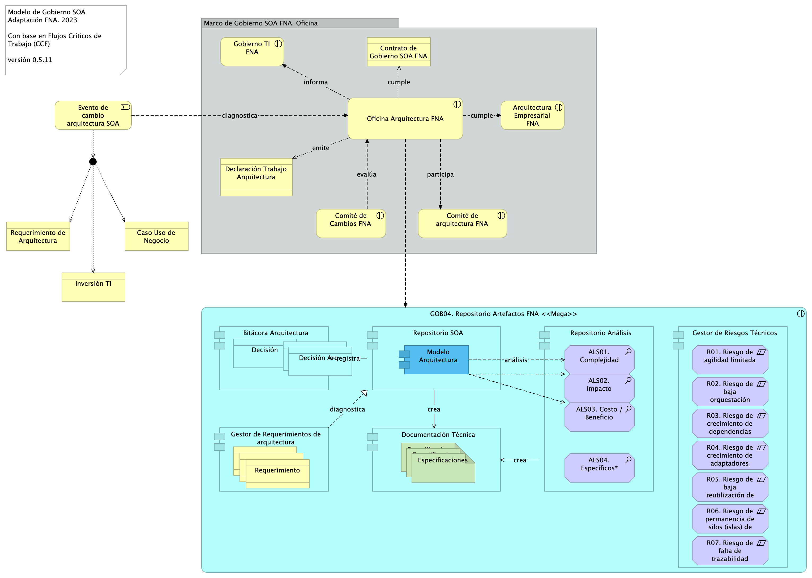

geometry:
  - top=1in
  - bottom=1in
fignos-cleveref: True
fignos-plus-name: Fig.
fignos-caption-name: Imagen
tablenos-caption-name: Tabla
...

*** 

>    E-Service. Fase II
>
>    PRY01. Gobierno SOA del FNA. Contenido de los Productos Contractuales
>
>    Contrato 1812020
>
>    FNA, Stefanini
>
>    30 Jun 2023
>
>    **Versión** 1.848dfe0

 

# Producto 4: PR04. Definición de roles y responsabilidades e instalación del comité
Desarrollo de procedimientos, funciones, entregables, selección de roles y herramientas a desplegar para la puesta en marcha de un Comité de Arquitectura del FNA adscrito a la Vicepresidencia de Tecnología FNA y en cumplimiento con el Gobierno SOA, versión 0.5, objeto de este proyecto.

**Nota**: los análisis de este producto están dirigidos a cumplir los objetivos del proyecto PRY01, Gobierno SOA: desarrollo, gestión, gobierno de arquitectura y adopción.

 

## Justificación
El Comité de Arquitectura es la entidad de supervisión ubicada entre la oficina de arquitectura (PR02, objeto de este proyecto) y los líderes de grupo de productos del FNA y áreas interesadas. Es una figura necesaria dado los resultados de los diagnósticos SOA, en particular el de riesgos técnicos, realizados en la Fase I de la consultoría E-Service que señalan como causantes a la complejidad y (baja) agilidad que enfrenta el FNA. El Comité de Arquitectura funge como complemento, apoyo y arbitraje (directriz) de los decisiones conciernentes a los trabajo de arquitectura del FNA dirigidos a la solución de estos problemas.

## Contenidos
1. Modelo operativo del Comité de Gobierno de Arquitectura del FNA: actores, información y procedimientos
1. Consideraciones para la puesta en marcha del Comité
1. Aplicaciones de soporte a la Oficina de Arquitecura (Pr02) y a la Vicepresidencia de Tecnología del FNA
1. Matriz de responsabilidades y procedimiento del Comité de Arquitectura
1. Métodos de evaluación de arquitecturas para el FNA

 

## Criterios de Aceptación
* Entendimiento funcional y operativa del comité de arquitectura del FNA
* Matriz de roles y procedimientos del del comité de  arquitetura del FNA

 

## Modelo de Implementación del PRY01
{#fig: width=lin}

_Fuente: Elaboración propia._

 

Modelo operativo del Comité

La evaluación de arquitectura queda ordenada en 3 aspectos:
1. Riesgos técnicos
2. Puntos de Sensibilidad
3. Compensaciones

Mecánica
1. Elaboración de escenarios (Arq.)
2. Evaluación de escenarios (Eval.)
3. Calificación del árbol utilidad (Arq.)

Escenarios
* operaciones más usadas en el negocio: cuáles son?

---
geometry:
  - top=1in
  - bottom=1in
fignos-cleveref: True
fignos-plus-name: Fig.
fignos-caption-name: Imagen
tablenos-caption-name: Tabla
...

***

>    E-Service. Fase II
>
>    PRY01. Gobierno SOA del FNA. Contenido de los Productos Contractuales
>
>    Contrato 1812020
>
>    FNA, Stefanini
>
>    30 Jun 2023
>
>    **Versión** 1.848dfe0

 

# Producto 5: PR05. Procesos de mejoramiento de diseño y vigilancia de riesgos técnicos
Uno de los principales valores que un Gobierno entrega es la identificación y la gestión de las acciones para controlar los riesgos. Y en el caso de este ejercicio de gobierno trataremos los riesgos de tecnología y de arquitectura SOA del FNA consignados en el estudio E-Service, Fase I (2022). 

El producto 5 es el detalle de los procedimientos y técnicas de tratamiento y modelamiento diseñadas para la operación de los riesgos técnicos del FNA consignados en el estudio E-Service, Fase I (2022).

**Nota**: los análisis de este producto están dirigidos a cumplir los objetivos del proyecto PRY01, Gobierno SOA: desarrollo, gestión, gobierno de arquitectura y adopción.

 

## Justificación
El tratamiento de los riesgos tecnológicos identifidos en el diagnóstco SOA de Fase I, E-Service (2022) (ver [03.Fase 1 PR3 Resultado Diagnóstico Situación Actual](N03a%a20Vsta%20aSegenta%20SOA%20FNA.md)) exigen acciones tal que mitiguen y adviertan al FNA sobre los impactos que estos comportan. El desarrollo de la vigilancia de los riesgos técnicos entra a reforzar al gobierno SOA del Fondo Nacional del Ahorro en curso en este proyecto y resulta en la personalización y aplicación de métodos que den tratamiento a estos. Además, operar los riesgos técnicos es de carácter obligatorio, dado que es un objetivo del Gobierno SOA del FNA: objtivo Vigilancia del riesgo tecnológico (G-OBJ1).

## Contenidos
1. Definición e identificación del riesgo técnico del FNA (E-Service, Fase I)
1. Modelamiento del riesgo técnico del FNA (Oficina de Arquitectura FNA)
1. Métodos para el tratamiento de los riesgos técnicos E-Service Fase I

 

## Criterios de Aceptación
* Procedimientos y técnicas de modelamiento para el tratamiento de los riesgos técnicos del FNA (E-Service, 2022)
* Matriz de riesgos técnicos e impactos del FNA

 

## Modelo de Implementación del PRY01
{#fig: width=lin}

_Fuente: Elaboración propia._

 

| Tema           | Gobierno SOA del FNA: **Riesgo Técnico de Arquitectura del FNA** |
|----------------|---------------------------------------------------------------|
| Palabras clave | SOA, Contexto, Áreas, Procesos, Objetivo                      |
| Autor          |                                                               |
| Fuente         |                                                               |
| Versión        | **1.848dfe0** del 30 Jun 2023                          |
| Vínculos       | [Ejecución Plan de Trabajo SOA](onenote:#N001d.sharepoint.com); [Procesos de Negocio FNA](onenote:#N003a.com)|

 

## Definición de Riesgo Técnico de Arquitectura del FNA
Es importante adoptar una definición de lo que es el riesgo técnico en el contexto de este proyecto. La definición ayudará en el logro de los objetos de este proyecto, identificar y realizar las estructuras de información y los diseños que los mitiguen.

Para la definición de riesgo técnico de las arquitecturas del FNA, en el contexto de este proyecto, utilizaremos un ejemplo de un caso existente en el FNA. 

    De las problemáticas encontradas en la Fase 1 del presente diagnóstico, nos referimos explícitamente a las que incrementan la complejidad de las soluciones SOA y soluciones de software del FNA, _como el manejo de dependencias de los servicios SOA del Fondo_. Es conocido y demostrado que solo esta condición es parte de la causa de los sobreesfuerzos que se dan en la evolución de dichas soluciones, y de las dificultades que se encuentran en los análisis de impacto de estos cambios (E-Service, Fase I, 2022).

Por otro lado, miremos aproximacines y definiciones de riesgo técnico generalmente aceptadas, como la enunciada por la ISO 31000:2009, o la del Enterprise Risk Management que citamos a contuación

    Partimos de la diferenciación del concepto de riesgo de la empresa y del profesional de la gestión de riesgos (ERM, o Enterprise Risk Management). Para el profesional de la gestión, riesgo es el "efecto que la incertidumbre tiene sobre la consecusión de los objetivos de negocio". En otras palabras, es una amenaza y es negativo.

O, esta otra, del Open Group

    Manejo de riesgo técnico en el estándar de TOGAF que se enfoca principalmente en los riesgos presentados en los proyectos de arquitectura (Open Group, Risk Management).

Vemos que para esta organización especializada el riesgo técnico de arquitectura es aquel que tiene que ver con los proyetos de arquitectura, diferente de otros enunciados, como el de la ERM (Enterprise Risk Management), que es más amplia y que se extiende hasta negocio, sistemas de información, privacidad, normatividad, cambio, ente otras.

En este proyecto, y en el mismo sentido de la definición de riesgo técnico de ambas definicones (ERM y Open Group), por su relación con las arquitecturas del FNA, acogemos parte de esta definición y la acotamos necesariamente al tratar únicamente sobre los _riesgos tecnológicos que amenazan (afectan) a las arquitecturas SOA y a la consecusión de objetivos de la Oficina de Arquitectura del FNA_.

    Por tanto, en este proyecto definimos, y trataremos sobre, el riesgo técnico como aquellos que afectan a los objetivos de la Oficina de Arquitectura, a la tecnología, al software y a los servicios SOA del FNA, que se identifiquen dentro del ejercicio del flujo de trabajo de dicha oficina y en los proyectos de arquitctura que sus involucrados ejecuten.

Desde aquí consideramos el concepto de riesgo técnico de arquitectura FNA que se dan por las decisiones de diseño, selección y migración de tecnología, transición de arquitecturas, alineación funcional, sobrecosto de inversión TI, complejidad de la implementación, entre otros. _Es intencional que al hacer foco del tratamiento a estos aspectos de riesgos de las arquitecturas del FNA, la utilidad, calidad y efecticidad del repositorio de arquitectura, y la misma arquitectura del FNA mejorará_ y su valor será evidente. 

# Antecedentes de Riesgo Técnico de Arquitectura FNA
Para elaborar los antecedentes de los riesgos técnicos de arquitectura del FNA, sujetos del gobierno de este proyecto, tomaremos como base los análisis previamente realizados en el FNA: 

1. Análisis de Madurez SOA del FNA (OSIMM, Open Group; E-Service, Fase I, 2022)
1. Análisis de Fortalezas/Debilidades SOA del FNA (SOA Patterns, Enterprise Integration Patterns; E-Service, Fase I, 2022)
1. Oportunidades Relevantes SOA del FNA (BPTrends; E-Service, Fase I, 2022)
1. Conclusiones Relevantes del Diagnóstico SOA del FNA (E-Service, Fase I, 2022)

 

De aquí extraemos trece áreas de riesgo técnico de arquitectura a considerar en este proyecto. El gobierno SOA del FNA debe buscar las capacidades internas para medir y gestionar tales riesgos que lo están afectando.

* R1. Riesgo de agilidad limitada (ver imagen 1)
* R2. Riesgo de baja orquestación SOA (ver imagen 2a y 2b)
* R3. Riesgo de crecimiento de dependencias entre servicios SOA
* R4. Riesgo de crecimiento de adaptadores particulares --opuesto al estándar-- (ver imagen 3)
* R5. Riesgo de baja reutilización de servicios SOA
* R6. Riesgo de permanencia de silos (islas) de servicios SOA y aplicaciones
* R7. Riesgo de falta de trazabilidad para la evolución e implementación de los servicios SOA

# Identificación de Riesgos Técnicos del FNA
Junto a esta complicación, que de por sí hace obligatoria la introdución de la figura del gobierno SOA en el Fondo, y que organizaciones como el OpenGroup señalan que se dan por la falta de Arquitectura Empresarial, y por consiguiente, por un débil gobierno, se encuentran otras que fueron levantadas en la Fase 1 del presente diagnóstico: agilidad limitada, complejidad e imprecisión en la trazabilidad, ocultamiento de funcionalidades (ver [04b.Resumen Fase 1](N03a%a20Vsta%20aSegenta%20SOA%20FNA.md)).

 

|Tema            |Gobierno SOA: **Riesgos tecnológicos del FNA** |
|----------------|---------------------------------------------------|
|Palabras clave|SOA, Gobierno, Riesgo, Objetivos de negocio|
|Autor||
|Fuente||
|Version|**848dfe0** del 30 Jun 2023|
|Vínculos|[Fase 2 PR6 Gobierno SOA](N03a%a20Vsta%20aSegenta%20SOA%20FNA.md)|

 

## Riesgos Tecnológicos del FNA
Los riesgos tecnológicos encontrados en el diagnóstco SOA de Fase 1 (ver [03.Fase 1 PR3 Resultado Diagnóstico Situación Actual](N03a%a20Vsta%20aSegenta%20SOA%20FNA.md)), y que describimos abajo, están incorporados a las vigilancias del gobierno SOA propuesto. A la vez, estos mismos riesgos descritos a continuación deben ser agregados a la matriz de gestión actual del Fondo, y gestionados por los métodos propios con los que ya cuenta el FNA.

 

### Gobierno SOA y Riesgos Tecnológicos del FNA
El gobierno SOA del FNA debe buscar la capacidad para medir y gestionar (agregar a la lista de riesgos de la empresa) los riesgos que lo están afectando.

* R1. Riesgo de agilidad limitada (ver imagen 1)
* R2. Riesgo de baja orquestación SOA (ver imagen 2a y 2b)
* R3. Riesgo de crecimiento de dependencias entre servicios SOA
* R4. Riesgo de crecimiento de adaptadores particulares --opuesto al estándar-- (ver imagen 3)
* R5. Riesgo de baja reutilización de servicios SOA
* R6. Riesgo de permanencia de silos (islas) de servicios SOA y aplicaciones
* R7. Riesgo de falta de trazabilidad para la evolución e implementación de los servicios SOA

 

_Fuente: elaboración propia, ae_fna_as_is.archimate._

 

_Fuente: ae_fna_as_is.archimate._

 

_Fuente: ae_fna_as_is.archimate._

 

_Fuente: ae_fna_as_is.archimate._

# Modelos de Gobiernos con Gestión de Riesgos Técnicos (versión 0.6)

{#fig: width=}

_Fuente: Diagnóstico SOA. E-Service (2022)._

 

05c.modelo riesgo

| Tema           | Gobierno SOA del FNA: **Modelamiento del riesgo técnico del FNA (Oficina de Arquitectura FNA)** |
|----------------|---------------------------------------------------------------|
| Palabras clave | SOA, Riesgo técnico, Modelo, Arquitectura                     |
| Autor          |                                                               |
| Fuente         |                                                               |
| Versión        | **1.848dfe0** del 30 Jun 2023                          |
| Vínculos       | [Ejecución Plan de Trabajo SOA](onenote:#N001d.sharepoint.com); [Procesos de Negocio FNA](onenote:#N003a.com)|

 

# Referencias {.page_break_before}
<!-- Explicitly insert bibliography here -->

E-Service. Situación SOA Actual del FNA. Etapa I. (2022).

E-Service. Arquitectura de Referencia del FNA. Etapa II. (2023).

E-Service. Hoja de Ruta e Iniciativas. Etapa III. (2023).

TOGAF 9.1. Risk Management (2023). En https://pubs.opengroup.org/architecture/togaf9-doc/arch/chap27.html

