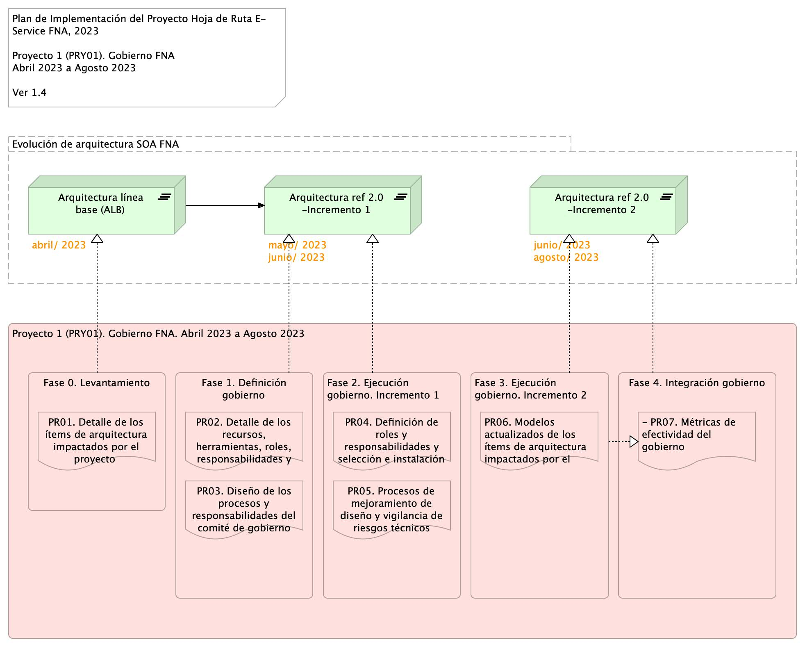
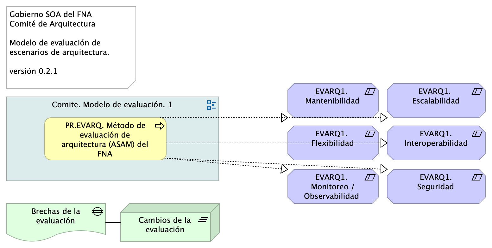
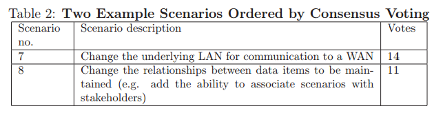
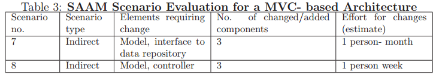
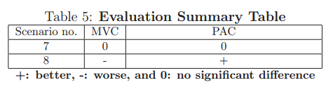

geometry:
  - top=1in
  - bottom=1in
fignos-cleveref: True
fignos-plus-name: Fig.
fignos-caption-name: Imagen
tablenos-caption-name: Tabla
...

\newpage

>    E-Service. Fase II
>
>    PRY01. Gobierno SOA del FNA. Contenido de los Productos Contractuales
>
>    Contrato 1812020
>
>    FNA, Stefanini
>
>    31 Jul 2023
>
>    **Versión** 1.1e99590

 

# Producto 4: PR04. Definición de roles y responsabilidades e instalación del comité
Desarrollo de procedimientos, funciones, entregables, selección de roles y herramientas a desplegar para la puesta en marcha de un Comité de Arquitectura del FNA adscrito a la Vicepresidencia de Tecnología FNA y en cumplimiento con el Gobierno SOA, versión 0.5, objeto de este proyecto.

**Nota**: los análisis de este producto están dirigidos a cumplir los objetivos del proyecto PRY01, Gobierno SOA: desarrollo, gestión, gobierno de arquitectura y adopción.

 

## Justificación
El Comité de Arquitectura es la entidad de supervisión ubicada entre la oficina de arquitectura (PR02, objeto de este proyecto) y los líderes de grupo de productos del FNA y áreas interesadas. Es una figura necesaria dado los resultados de los diagnósticos SOA, en particular el de riesgos técnicos, realizados en la Fase I de la consultoría E-Service que señalan como causantes a la complejidad y (baja) agilidad que enfrenta el FNA. El Comité de Arquitectura funge como complemento, apoyo y arbitraje (directriz) de las decisiones concernientes a los trabajos de arquitectura del FNA dirigidos a la solución de estos problemas.

## Contenidos
1. Proceso de soporte y alineación de arquitecturas: Oficina y Negocio FN
1. Modelo operativo del Comité de Gobierno de Arquitectura del FNA: actores, información y procedimientos
1. Consideraciones para la puesta en marcha del Comité
1. Matriz de responsabilidades y procedimientos del Comité de Arquitectura
1. Método de evaluación de arquitecturas para el FNA

 

## Criterios de Aceptación
* Entendimiento funcional y operativa del comité de arquitectura del FNA
* Matriz de roles y procedimientos del del comité de arquitectura del FNA

 

## Modelo de Implementación del PRY01
{#fig: width=lin}

_Fuente: Elaboración propia._

 

\newpage

| Tema           | Comité de Arquitectura del FNA: **Descripción del Comité de Gobierno de Arquitecturas del FNA** |
|----------------|--------------------------------------------------------------|
| Palabras clave | SOA, Comité arquitectura, Procesos, Objetivos, Modelo        |
| Autor          |                                                              |
| Fuente         |                                                              |
| Versión        | **1.1e99590** del 31 Jul 2023                         |
| Vínculos       | [Ejecución Plan de Trabajo SOA](onenote:#N001d.sharepoint.com); [Procesos de Negocio FNA](onenote:#N003a.com)|

 

# Modelo operativo del Comité de Arquitectura del FNA
A partir del modelo inicial del Comité descrito en [Descripción del Comité de Gobierno de Arquitecturas del FNA](<../../fna-dd-f2-e1/content/03n.1.descripcion comite.md>), en esta sección ampliaremos detalles de los conceptos operativos y de la puesta en marcha del Comité dentro del FNA. 

Partimos de la definición de Comité de Arquitectura enunciada para el FNA.

    El Comité de Arquitectura del FNA (CAF) materializa el gobierno SOA. Lleva a cabo los procesos de aprobación de las arquitecturas y contribuye con el gobierno al realizar tareas de revisión, decisión, seguimiento (en menor grado) y divulgación de trabajos de arquitectura. 

De esta definición destacamos el rol clave que el Comité juega para el gobierno y describiremos los procesos operativos que este debe realizar y que lo constituyen como tal.

## Procesos del Comité de Arquitectura FNA (CAF)
Para cumplir sus objetivos y funciones (ver [Objetivos Específicos del CAF](<04.a1.modelo comite.md>) debemos definir los procesos que este debe realizar.

Un error frecuente es asumir que el Comité influye en las decisiones de la empresa, o en sus estrategias. No lo hace. Tampoco en las estrategias de TI de la empresa, como son la adopción de prácticas o tecnologías que este ha determinado ya convenientes. El Comité no modifica ni controvierte este tipo de decisiones. No es un Comité de decisiones. El Comité de arquitectura, para ser exitoso, deben apegarse y apoyar a los procesos de gobierno de las arquitecturas del FNA, y ejecutar, por tanto, sus propios procesos.

    Importante. El CAF no es un Comité de decisiones porque no incide en las estrategias de negocio ni en las de TI. El Comité de arquitectura, para ser exitoso, deben apegarse y apoyar a los procesos de gobierno de las arquitecturas del FNA, y ejecutar, por tanto, sus propios procesos.

El Comité de Arquitectura debe realizar los procesos siguientes, que a la vez, explican el por qué el FNA deben este tipo de entes de gobierno.
1. Aprobar y publicar las arquitecturas resultantes (sean reformas, adaptaciones, migraciones, o arreglos), 
1. Evaluar las arquitecturas resultantes y la adherencia a la arquitectura de referencia
1. Determinar las acciones que los interesados de las nuevas arquitecturas, o sus transiciones, deben conocer para la corrección de las inconformidades
1. Divulgar conocimientos de arquitectura, entendidos como diseño, soluciones, prácticas y herramientas a los ingenieros e interesados del FNA

 

En el siguiente diagrama resumimos la actuación y colaboración del modelo operativo del Comité de Arquitectura. 

{#fig: width=}

_Fuente: elaboración propia._

 

## Conformación del Comité para el Gobierno SOA del FNA
El equipo del trabajo del CAF requerido, conforme el modelo de gobierno SOA presentado en este proyecto, se compone de los roles de gestión de la tecnología y arquitectura en los ámbitos de diseño de servicios SOA y componentes de software: arquitecto SOA, o quien haga las veces de este); infraestructura tecnológica y redes: arquitecto de TI; aplicaciones de solución y herramientas de software: arquitecto de aplicaciones; y del especialista de las estructuras de datos e información del negocio: Arq. de datos.

{#fig: width=}

_Fuente: E-Service, Fase I (2022)._

 

Estos recursos deben funcionar como recursos propios de la organización, sin perjuicio de que sean externos. Lo anterior, debido a la gestión de conocimiento del _activo más importante del gobierno SOA: las arquitecturas SOA y la arquitectura de referencia 2.0 del FNA, junto a los vínculos de estas con los contextos de negocio y TI_.

\newpage

| Tema           | Gobierno SOA del FNA: **Método de evaluación de arquitecturas para el FNA**  |
|----------------|------------------------------------------------------------------------|
| Palabras clave | SOA, Evaluación de arquitectura, ATAM, Método  |
| Autor          |                                                |
| Fuente         |                                                |
| Versión        | **1.1e99590** del 31 Jul 2023           |
| Vínculos       | [Ejecución Plan de Trabajo SOA](onenote:#N001d.sharepoint.com); [Procesos de Negocio FNA](onenote:#N003a.com) |

 

# Método de Evaluación de Arquitecturas para el FNA (EVALF)
La evaluación arquitectónica es la máxima en el cumplimiento tanto del Gobierno SOA del FNA, versión 0.6 (incluye riesgos técnicos) como de la misión del propio Comité de Arquitectura del Fondo (CAF). Este ejercicio, de realizarse reduce el esfuerzo y los costos de desarrollo de las soluciones de servicios y software, y guarda la calidad al verificar la dirección y sentido de los requisitos y al identificar los riesgos potenciales. 

El objetivo de los evaluadores (arquitectos de la oficina, normalmente) proporcionen garantías a los ingenieros, desarrolladores, proveedores y fábricas de software del FNA de que la arquitectura elegida cumplirá con los requisitos de calidad, tanto funcionales como no funcionales. 

    La evaluación de arquitectura, como está definida aquí, proporcione garantías a los ingenieros, desarrolladores, proveedores y fábricas de software del FNA de que el diseño elegido cumplirá con los requisitos de calidad funcionales y sistémicos (no funcionales).

    Importante. Una máxima de la evaluación de arquitectura es que debe traer más beneficios que costos.

En este aparte desarrollaremos el método de evaluación de arquitecturas acondicionado para la Oficina y el Comité de Arquitectura (CAF) del Fondo, tal que cumpla con las características determinadas en ([Características del Método de Evaluación de Arquitecturas](../../fna-dd-f2-e1/content/03n.3.evaluacion.md)) para esta herramienta.

Las características que el método de evaluación debe cumplir son las indicadas en la siguiente table.

| **1. Organización** |                                                          |
|---------------------|----------------------------------------------------------|
|                     | 1. Riesgos técnicos                                      |
|                     | 2. Puntos de Sensibilidad al Cambio                      |
|                     | 3. Compensaciones                                        |
|                     | 4. Costo / Beneficio                                     |
|                     |                                                          |
| **2. Elementos**    |                                                          |
|                     | 1. Escenarios de calidad                                 |
|                     | 2. Sistema de puntuación                                 |
|                     | 3. Árbol de utilidad (diversificación)                   |

Table: Características que cumple el método de evaluación de arquitectura (MEVFNA) seleccionado para el FNA. {#tbl:atam-id}

 

# Evaluación de Arquitecturas FNA Basada en Escenarios (ASAM)
La evaluación por escenarios (ASAM, por sus siglas en inglés) basado en ATAM del Open Group, ofrece una manera efectiva (en comparación con otros métodos [^evalcomp]) de encontrar el valor de aptitud de una arquitectura de servicios o de software respecto a atributos de calidad competitivos. 

[^evalcomp]: Software Architecture Evaluation Methods – A survey. P. Shanmugapriya, Research Scholar, Department of CSE, SCSVMV University, Enathur, Tamilnadu, INDIA

El principal valor de la evaluación por escenarios es contestar de manera sistemática la pregunta de control: ¿puede esta arquitectura o no ejecutar este escenario? La evaluación debe determinar los componentes de la arquitectura implicados en el resultado a favor o no de la pregunta de control. Si la arquitectura falla en el propósito de ejecutar el escenario, es obligatorio del método dar parte de la lista de cambios en la arquitectura que sean requeridos para soportarlo, y por supuesto, estimar su costo/beneficio. 

    Importante. El valor de la evaluación por escenarios es contestar de manera sistemática la pregunta de control: ¿puede esta arquitectura o no ejecutar este escenario?, y estimar el costo/beneficio del cambio.

El método por escenarios, ASAM, ayuda además a encontrar _arquitecturas candidatas_, o cambios interesantes sobre una arquitectura ejecutable. Las arquitecturas o cambios candidatos se describen en términos de los elementos arquitectónicos de interés (componentes de la arquitectura, o del software) para cada uno de los atributos de calidad. 

En la siguiente ilustración resumimos las acciones y relaciones que este método requiere.

{#fig: width=}

_Fuente: elaboración propia._

 

Los atributos de calidad de sistemas que pueden usarse como referencia para el método propuesto de evaluación son los indicados en la imagen siguiente.

{#fig: width=}

_Fuente: elaboración propia._

 

Al final, el método propuesto debe entregar información accionable y de soporte de decisiones y planeación para la actualización/o no, de la plataforma tecnológica del SIAFP.

## Proceso de Evaluación Basado en Escenarios (ASAM)
Descripción del modelo de evaluación propuesto.

Para la evaluación de arquitectura y proveedores utilizaremos el proceso sugerido por los métodos de basados en escenarios. En este tipo de procesos la parte central es la selección y elaboración de los escenarios tanto técnicos como de negocio.

### 0. Descripción de escenarios directos
La descripción de escenarios se la realizará mediante un diagrama dinámico de flujo de trabajo. Ejemplo.

{#fig: width=}

_Fuente: ASAM. Department of CSE, SCSVMV University._

### 0.1. Priorización de escenarios
La priorización de escenarios se la realizará por votación. La votación estará a cargo de los  arquitectos de la Oficina FNA.

{#fig: width=}

_Fuente: ASAM. Department of CSE, SCSVMV University._

### 1. Evaluación de escenarios
Para la evaluación de los escenarios se utilizará una variante del método cualitativo. Los criterios de la evaluación se basarán en la criticidad del riesgo del componente, en lugar, de cantidad de componentes, indicada en el siguiente ejemplo.

{#fig: width=}

_Fuente: ASAM. Department of CSE, SCSVMV University._

### 2. Comparación de escenarios
**Nota**. Por cada arquitectura se evalúan los mismos escenarios.

Si por cada requerimiento de negocio/técnico, se obtienen varios escenarios, se realizará la comparativa de puntos entre los escenarios donde el mejor puntaje gana. El sistema de puntuación para los escenarios es el propuesto a continuación.

{#fig: width=}

_Fuente: ASAM. Department of CSE, SCSVMV University._

### 3. Salidas del Proceso de Evaluación
* SAL01. Análisis de Sensibilidad: Decisiones de arquitectura que impacta positivamente al negocio.
* SAL02.  Mapa de Riesgos Arquitectónicos: Son aquellos para los que no hay valor satisfactorio como respuesta a una acción desde un enfoque arquitectónico.
* SAL03.  Lista de Conformidades (no-riesgos)
* SAL04.  Resultado del Cuestionario de evaluación (respuestas a preguntas de análisis)

 

\newpage

| Tema           | Gobierno SOA del FNA: **Proceso de soporte y alineación de arquitecturas: Oficina y Negocio FNA**  |
|----------------|-----------------------------------------------------------------------|
| Palabras clave | SOA, Evaluación de arquitectura, ASAM, Método  |
| Autor          |                                                |
| Fuente         |                                                |
| Versión        | **1.1e99590** del 31 Jul 2023           |
| Vínculos       | [Ejecución Plan de Trabajo SOA](onenote:#N001d.sharepoint.com); [Procesos de Negocio FNA](onenote:#N003a.com) |

 

# Proceso de Soporte y Alineación de Arquitecturas con Negocio FNA
## Identificar y Priorizar los Casos de Uso Significativos
La primera tarea que debe ser realizada durante la definición de la arquitectura del proyecto es identificar los requerimientos funcionales y no funcionales que son significativos para la arquitectura objetivo. El capítulo de visión dentro de la [Especificación Trabajo de Arquitectura](../../fna-dd-f2-e1/content/02n.2a.oficina.md) dada, sumado a los requerimientos definidos en la etapa de levantamiento de los líderes de grupo del FNA son los insumos que le permiten al arquitecto involucrado identificar aquellos requerimientos que influencian la arquitectura de manera significativa.

Los requerimientos identificados como significativos son los que se documentan en la [vista de casos de uso](https://stefaninilASAM.sharepoint.com/SitePages/Home.aspx) del documento de arquitectura. 

## Establecer la Arquitectura Candidata
El propósito de esta actividad es definir el bosquejo inicial de la arquitectura del sistema. Esta actividad se basa en revisar las experiencias pasadas de la organización (Revisión de la base de datos de conocimiento), la arquitectura candidata toma en cuenta los requerimientos funcionales y no funcionales (disponibilidad, desempeño, escalabilidad) del sistema.

Ej. Una arquitectura en N-capas donde la aplicación es WEB-enabled, que probablemente será el acceso a través de Web Services en un futuro cercano.

Para seleccionar la arquitectura se debe utilizar el proceso de PR-TDEC-001-Toma de Decisiones, dado que es necesario que el arquitecto plantee más de una alternativa de solución, defina escenarios de operación del sistema, defina criterios, evalúe y documente la decisión final.

## Definir el Modelo de Despliegue Inicial
En este punto se define un diagrama de alto nivel de despliegue del nuevo sistema. En este diagrama se muestran los diferentes nodos en los cuales va a operar el nuevo sistema, así como los posibles escenarios de infraestructura en que se va a ejecutar el nuevo sistema.

## Identificar los Elementos Claves de Diseño en la Arquitectura
A partir de los documentos de requerimientos (Visión, Casos de Uso, Glosarios, Requerimientos no funcionales) el arquitecto puede extraer los elementos técnicos y conceptuales claves de la solución. En este estado, es importante definir los elementos de vocabulario comunes al proyecto en la fase implementación.

Algunos ejemplos de elementos claves de la solución son:

* Integración con sistemas legados
* Concurrencia
* Persistencia
* Uso de tecnología desconocida por el equipo de trabajo
* Históricos
* Seguridad
* Auditoría
* Tolerancia a Fallos
* Refinar el modelo de análisis

 

El objetivo de esta actividad es complementar y refinar el análisis realizado para los casos de uso identificados en el paso 1.

En este punto se vincula el modelo de análisis de los casos de uso significativos elaborados en la etapa de análisis del proyecto.

Los elementos de análisis son todas las clases de análisis involucradas en la realización de los casos de uso. Tradicionalmente las clases son asociadas al estereotipo de análisis. Para cada realización significativa de casos de uso, el propósito es definir los aspectos estáticos y dinámicos del caso de uso. Como resultado del análisis se deben identificar todas las clases de diseño posibles, estas son las que se agrupan para definir los componentes funcionales de la aplicación, para efectos de arquitectura en esta fase se definen los componentes funcionales que componen la aplicación.

El modelo de análisis puede ser reutilizado para muchas diferentes implementaciones. Y la definición para sus componentes debe ser administrada por el área de procesos.

## Elaborar el Modelo de Diseño 
Una vez que las realizaciones de los casos de uso han sido documentadas en el modelo de análisis, es tiempo de profundizar y bajar al diseño concreto de los componentes.

Mientras que el modelo de análisis es abstracto, el modelo del diseño debe estar mucho más cerca de la implementación real. El arquitecto de software necesita identificar una tecnología para implementar la solución. El arquitecto debe estar en capacidad de diseñar los mecanismos, tomando ventaja de los elementos que le brinda la tecnología.

El modelo define las dependencias entre las capas del negocio que serán registradas en el documento de arquitectura, utilizando UML como lenguaje de modelamiento, y los diagramas de clases, de estados, de secuencia y colaboración, como mecanismos para mostrar el diseño estático y dinámico de la aplicación.

Las especificaciones de los componentes.

Este es el primer aspecto que un arquitecto de software debe definir, para cada componente es importante especificar los datos que éste manipula (DTO's) y sus interfaces, incluyendo las operaciones disponibles.

La realización de los casos de uso estarán en el lugar de diseñar las vistas dinámicas y estáticas de un componente utilizando diagramas de clases y de secuencia.

Paquetes de implementación de análisis.

Luego es necesario definir el detalle de diseño de cada componente. Esto se hace en un paquete específico llamado diseño de implementación.

Implementando Paquetes de Diseño.

Aquí es importante definir todas las clases con sus atributos y operaciones. Esta tarea no es siempre responsabilidad del arquitecto de software. Dependiendo del tamaño del equipo el rol de diseñador de software puede ser asignado a una o a varias personas.

Diagrama de clase de los componentes del sistema

Durante esta fase el arquitecto también completa un prototipo de operación del sistema. Este es el prototipo evolutivo, el cual es la base que será utilizada como punto de partida en la fase de construcción.

Establecer el modelo de paquetes y divisiones del sistema.

El modelo de implementación es el que contiene el código fuente del sistema, como labor del diseño de la arquitectura se debe definir la estructura de los mismos, y publicarla para uso del equipo de trabajo del proyecto.
Documentar los mecanismos de operación de los elementos claves.  
El propósito de esta actividad es dejar en papel las guías de trabajo para los mecanismos que requiere el sistema, se trata de documentar las soluciones técnicas a los elementos claves del desarrollo definidos en el paso 4 de este procedimiento,

Para la documentación de estos mecanismos el arquitecto debe utilizar los artefactos de UML que considere necesarios para especificar la solución que le sirva de guía a los diseñadores y desarrolladores para ejecutar el desarrollo. Para el diseño de los mecanismos se utiliza el procedimiento de diseño (4.3 Realizar Diseño).

Por ejemplo, para el caso de concurrencia el arquitecto puede elaborar un modelo de despliegue, donde el arquitecto ilustra, por ejemplo, que la solución maneja un cluster para balanceo de carga.

## Elaborar la estrategia de implementación  
Como parte importante de la arquitectura, está la definición de la estrategia de desarrollo del proyecto, se trata de definir la forma como se debe priorizar los diferentes elementos y componentes del desarrollo de tal forma que se cumplan los objetivos del proyecto. La estrategia es el mecanismo con el que cuenta el arquitecto para mitigar los riesgos desde la visión técnica del proyecto.

Cuando se trata de proyectos donde se desconoce el negocio y el grupo de trabajo desconoce la tecnología, la decisión sobre la estrategia de desarrollo es vital para el proyecto, por esta razón se deben plantear diferentes alternativas, definir criterios de selección, evaluarlas y documentar la alternativa ganadora, en este punto se debe hacer uso del proceso PR-TDEC-001-Toma de Decisiones.

## Solicitar Revisión de la arquitectura - ASAM
El Gerente o el Arquitecto del Proyecto debe someter el diseño al comité de Arquitectura quienes realizarán la revisión correspondiente aplicando el Método ASAM (Architecture Scenario Analysis Method).

## Planeación de la evaluación  
El equipo evaluador se reúne con los principales stakeholders del proyecto a evaluar para crear un plan de evaluación. Las personas que participan en este paso son el gerente del proyecto cliente, y líder de equipo ASAM.

## Presentación de proceso ASAM  
El equipo evaluador hace una presentación del proceso ASAM y de las actividades que se llevarán a cabo para ejecutarlo. Para esto se debe contar con el proceso ASAM utilizando el documento (documento o anexo técnico Evaluación ASAM) y realizar la presentación de evaluación ASAM (documento o anexo técnico Presentación ASAM). Luego de realizar la presentación los stakeholders estarán preparados para la evaluación.

En esta labor participan el Gerente del proyecto evaluado, Arquitecto del proyecto evaluado, Stakeholders con poder de decisión y el equipo evaluador.

## Presentación de Motivadores de Negocio
El gerente del proyecto que está siendo evaluado hace una presentación de los motivadores de negocio (documento o anexo técnico Plantilla_motivadores_de_negocio). Para esto se hace uso de la plantilla de presentación de motivadores de negocio y como resultado de esta labor se definen:

* Los atributos de calidad
* Las restricciones técnicas, económicas, administrativas o políticas
* Los objetivos de negocio
* Motivadores arquitecturales

 

Participan de esta labor el Gerente del proyecto evaluado, el Arquitecto del proyecto evaluado y el equipo evaluador.

## Presentación de la Arquitectura  
Teniendo en cuenta la presentación de arquitectura, los atributos de calidad identificados y las restricciones.

El arquitecto del proyecto evaluado hace una presentación de la arquitectura del sistema mediante documento o anexo técnico. Debe explicarla con un nivel de detalle suficiente para el tiempo con que se cuenta, la cantidad de diseño elaborado, documentación disponible y naturaleza de los requerimientos.

Durante esta evaluación el equipo debe verificar que el arquitecto haya tenido en cuenta los elementos identificados en la presentación de los motivadores de negocio. También debe hacer las preguntas.

Se deben establecer como salida los enfoques arquitecturales, estrategias de solución de atributos de calidad, trazabilidad entre algunos escenarios y como los enfrenta la arquitectura.

En esta labor participan el Gerente del proyecto, el Arquitecto del proyecto evaluado y el equipo evaluador.

## Identificar Enfoques de Solución de Arquitectura
Teniendo en cuenta la documentación de la arquitectura, la presentación de la arquitectura y los patrones arquitectónicos, en este paso el equipo evaluador se enfoca simplemente en catalogar los patrones y enfoques evidentes. Esta lista es capturada públicamente y sirve para el análisis posterior.

El equipo evaluador debe obtener los patrones que se usan explícitamente de acuerdo con la presentación de la arquitectura y a la documentación disponible. Además, deben analizar la solución para encontrar patrones que no sean mencionados o de los que quizá el arquitecto no es consciente.

Como resultado de este paso se obtiene el catálogo de patrones y los enfoques arquitecturales usados en la solución y participan el Arquitecto del proyecto evaluado y el equipo evaluador.

## Generar Árbol de Utilidad  
Se tienen en cuenta los atributos de calidad identificados y las presentaciones sobre la arquitectura y los motivadores de negocio 

En este paso trabajan conjuntamente el equipo evaluador, el arquitecto o grupo de arquitectura, el gerente del proyecto y posiblemente un representante del cliente para identificar, priorizar y refinar los atributos de calidad más importantes. Este paso tiene un enfoque descendente (top down).

El proceso para generar el árbol de utilidad es el siguiente:

1. Crear el nodo padre llamado Utilidad.
1. Agregar como hijos del nodo raíz los atributos de calidad identificados en los pasos anteriores, * especialmente en la presentación de motivadores de negocio y la presentación de la arquitectura. * Ejemplos de estos atributos de calidad son: Rendimiento, Mantenibilidad, Disponibilidad.
1. Cada atributo de calidad es refinado con elementos más específicos de cara a la generación de * escenarios. Por ejemplo, Rendimiento puede ser descompuesto en latencia de datos y rendimiento de la * transacción. Este refinamiento está directamente relacionado con la caracterización del atributo de * calidad.
1. Como hojas del árbol de utilidades se agregan escenarios a cada refinamiento de los atributos de * calidad. Un escenario debe tener un estímulo, un entorno y una respuesta. Por ejemplo: "Bajo * condiciones normales de ejecución el almacenamiento de un cliente en BD debe tomar como máximo 10 * segundos".
1. Ahora los stakeholders con poder de decisión asignan una prioridad a cada escenario según su * importancia. Cada escenario puede ser marcado de prioridad Alta, Media o Baja.
1. El arquitecto prioriza los escenarios basados en cuan complejo va a ser para la arquitectura * satisfacerlo.
1. Para la generación del árbol de utilidad tenga en cuenta estos tres tipos de escenarios:
1. Casos de Uso: El comportamiento que el usuario espera del sistema.
1. Evolución: Anticipar cambios típicos al sistema.
1. Exploración: Escenarios que estresan el sistema. Su objetivo es descubrir los límites del diseño * actual.

A partir de la segunda iteración en este paso se realiza una revisión y refinamiento del árbol previamente elaborado.

Como resultado de la generación del árbol, habrá un listado de los escenarios priorizados por importancia y dificultad.

## Definición y Priorización de Escenarios  
Este paso tiene como objetivo reunir todos los stakeholders importantes del proyecto y generar un listado de escenarios para priorizar y analizar posteriormente. Con esta tarea se puede medir la alineación entre el diseño del arquitecto y los deseos reales de los stakeholders.

Dado que esta tarea marca el comienzo de la segunda fase de la evaluación, debe comenzar con un repaso de la metodología ASAM y una guía sobre la generación de escenarios.

Todos los participantes aportan escenarios relacionados con lo que será su interacción con el sistema. Por ejemplo, un líder técnico puede referirse a la mantenibilidad, un líder de pruebas sobre la facilidad de realizar pruebas funcionales y vendedor sobre características de rendimiento y flexibilidad que faciliten su tarea.

Los stakeholders pueden revisar los escenarios y mezclar varios que apunten hacia el mismo objetivo o dividir escenarios que afecten muchos atributos de calidad.

Con el listado de escenarios preparado, se pasa al proceso de priorización que consiste en asignar a cada stakeholder un número de puntos igual al 30% del número de escenarios redondeado hacia arriba, por ejemplo, para 20 escenarios cada usuario tendrá 6 votos. Cada stakeholder debe repartir sus puntos entre los escenarios disponibles de la forma que él quiera, por ejemplo, asignando 2 puntos a 3 escenarios o asignar 6 a uno sólo.

El líder de la evaluación ordena los escenarios por número de votos. El grupo selecciona los escenarios principales para ser evaluados. Puede ser seleccionando los n primeros o todos los escenarios con más de x puntos.

El líder de la evaluación debe comparar los escenarios generados en esta actividad contra los escenarios del árbol de utilidad para verificar  si el arquitecto pasó por alto algunos requerimientos y si la visión del arquitecto está alineada con la de los stakeholders.

Como resultado de esta labor se obtiene un nuevo grupo de escenarios priorizado y participan los stakeholders representativos del proyecto y el equipo evaluador.

## Evaluar Arquitectura vs Escenarios  
Teniendo en cuenta el árbol de utilidades, los enfoques y patrones identificados, el formato PT-INGE-031-Análisis arquitectónico de escenarios, los patrones arquitectónicos con sus ventajas y desventajas asociadas y la caracterización de los atributos de calidad, se realizan lo siguiente:

El equipo evaluador selecciona el grupo de escenario más importantes. Debe seleccionar un número de acuerdo con el tiempo con que se cuenta para la evaluación y a lo pactado con el cliente.
El arquitecto debe explicar como la arquitectura soporta cada escenario.
Los miembros del equipo evaluador verifican/prueban cada enfoque arquitectural y su interpretación sea apropiada para ajustarse al atributo de calidad específico.
Durante el transcurso de la evaluación del escenario los evaluadores documentan:

- Decisiones arquitecturales relevantes
- Riesgos
- No riesgos
- Puntos sensibles
- Compensaciones

 

Para la evaluación de cada escenario se puede usar el formato "Formato de Análisis Arquitectónico de Escenarios". Para cada escenario analizado, se tienen en cuenta: Decisiones más importantes, Riesgos, No riesgos, Puntos Sensibles, Puntos de Compensación.

## Conciliación de Resultados
Teniendo en cuenta el análisis de los escenarios el equipo evaluador revisa con el equipo evaluado una versión preliminar de los hallazgos y realizan una conciliación de éstos. Ambos equipos deben estar de acuerdo en los resultados que se presentarán en la reunión con todos los stakeholders.

En esta labor participan el Gerente del proyecto evaluado, el Arquitecto del proyecto evaluado, el Líder del equipo ASAM y el Líder de la evaluación con el fin de que la información como riesgos, no riesgos, puntos sensibles y puntos de compensación estén completos. 

## Correcciones Según Evaluación  
Teniendo en cuenta el reporte de la evaluación de los escenarios (Riesgos, no riesgos, puntos sensibles, puntos de compensación) y si hay nuevos escenarios/ítems por evaluar El arquitecto realiza los ajustes necesarios para continuar con la evaluación. Estos ajustes pueden ser:

* Mejorar la documentación de la arquitectura
* Aclarar Requerimientos no Funcionales (RNF)
* Aclarar motivadores de negocio
* Documentar nuevos artefactos/decisiones

 

Luego de realizar estas labores se define el plan para la siguiente iteración.

Primera parte de presentación de resultados (hallazgos)  
Teniendo en cuenta la documentación presentada en los pasos anteriores, el equipo evaluador hace una presentación de los hallazgos encontrados y conciliados durante la evaluación.

Como resultado de esta labor se tiene el informe con los resultados de la evaluación (Enfoques arquitecturales documentados, Listado de la lluvia de escenarios y su priorización, Árbol de utilidades, Riesgos, No riesgos, Puntos sensibles y de compensación). Participan de esta labor el equipo Evaluador y el equipo Evaluado.

## Segunda parte de presentación de resultados (Mitigación de riesgos)  
El arquitecto y el equipo evaluado presentan un listado de las actividades que se usarán para mitigar los hallazgos encontrados por el equipo evaluador.

Como resultado se deben crear las actividades propuestas para mitigar los hallazgos.

## Revisión y seguimiento de la arquitectura  
La definición de la arquitectura es una tarea que se hace durante todo el ciclo del proyecto y su documento está vivo a través de todo el ciclo de vida, aunque su énfasis es en las primeras etapas del proyecto. El arquitecto debe someter su diseño a la revisión de pares para la cual utiliza la lista de chequeo definida en la hoja "Arquitectura" del producto de trabajo PT-INGE-028-Listas de chequeo.

Así mismo el arquitecto es el responsable de hacer seguimiento del cumplimiento de la arquitectura durante todo el proyecto, para esto diligencia la revisión de los documentos de diseño y del documento de arquitectura.

**Nota**. Tenga en cuenta que el documento de arquitectura resume los temas más relevantes de los productos de trabajo de otras fases del proyecto, en la mayoría de los casos se crean vínculos a los documentos en donde están los productos de trabajo mencionados.

---
geometry:
  - top=1in
  - bottom=1in
fignos-cleveref: True
fignos-plus-name: Fig.
fignos-caption-name: Imagen
tablenos-caption-name: Tabla
...

\newpage

>    E-Service. Fase II
>
>    PRY01. Gobierno SOA del FNA. Contenido de los Productos Contractuales
>
>    Contrato 1812020
>
>    FNA, Stefanini
>
>    31 Jul 2023
>
>    **Versión** 1.1e99590

 

# Producto 5: PR05. Procesos de mejoramiento de diseño y vigilancia de riesgos técnicos
Uno de los principales valores que un Gobierno entrega es la identificación y la gestión de las acciones para controlar los riesgos. Y en el caso de este ejercicio de gobierno trataremos los riesgos de tecnología y de arquitectura SOA del FNA consignados en el estudio E-Service, Fase I (2022). 

El producto 5 es el detalle de los procedimientos y técnicas de tratamiento y modelamiento diseñadas para la operación de los riesgos técnicos del FNA consignados en el estudio E-Service, Fase I (2022).

**Nota**: los análisis de este producto están dirigidos a cumplir los objetivos del proyecto PRY01, Gobierno SOA: desarrollo, gestión, gobierno de arquitectura y adopción.

 

## Justificación
El tratamiento de los riesgos tecnológicos identificados en el diagnóstico SOA de Fase I, E-Service (2022) (ver [03.Fase 1 PR3 Resultado Diagnóstico Situación Actual](N03a%a20Vsta%20aSegenta%20SOA%20FNA.md)) exigen acciones tal que mitiguen y adviertan al FNA sobre los impactos que estos comportan. El desarrollo de la vigilancia de los riesgos técnicos entra a reforzar al gobierno SOA del Fondo Nacional del Ahorro en curso en este proyecto y resulta en la personalización y aplicación de métodos que den tratamiento a estos. Además, operar los riesgos técnicos es de carácter obligatorio, dado que es un objetivo del Gobierno SOA del FNA: objetivo Vigilancia del riesgo tecnológico (G-OBJ1).

## Contenidos
1. Definición e identificación del riesgo técnico del FNA (E-Service, Fase I)
1. Métodos para el tratamiento de los riesgos técnicos E-Service Fase I
1. Modelamiento del riesgo técnico del FNA (Oficina de Arquitectura FNA)

 

## Criterios de Aceptación
* Procedimientos y técnicas de modelamiento para el tratamiento de los riesgos técnicos del FNA (E-Service, 2022)
* Matriz de riesgos técnicos e impactos del FNA

 

## Modelo de Implementación del PRY01
{#fig: width=lin}

_Fuente: Elaboración propia._

 

\newpage

| Tema           | Gobierno SOA del FNA: **Riesgo Técnico de Arquitectura del FNA** |
|----------------|---------------------------------------------------------------|
| Palabras clave | SOA, Contexto, Áreas, Procesos, Objetivo                      |
| Autor          |                                                               |
| Fuente         |                                                               |
| Versión        | **1.1e99590** del 31 Jul 2023                          |
| Vínculos       | [Ejecución Plan de Trabajo SOA](onenote:#N001d.sharepoint.com); [Procesos de Negocio FNA](onenote:#N003a.com)|

 

# Definición de Riesgo Técnico de Arquitectura del FNA
Es importante adoptar una definición de lo que es el riesgo técnico en el contexto de este proyecto. La definición ayudará en el logro de los objetos de este proyecto, identificar y realizar las estructuras de información y los diseños que los mitiguen.

Para la definición de riesgo técnico de las arquitecturas del FNA, en el contexto de este proyecto, utilizaremos un ejemplo de un caso existente en el FNA. 

    De las problemáticas encontradas en la Fase 1 del presente diagnóstico, nos referimos explícitamente a las que incrementan la complejidad de las soluciones SOA y soluciones de software del FNA, _como el manejo de dependencias de los servicios SOA del Fondo_. Es conocido y demostrado que solo esta condición es parte de la causa de los sobreesfuerzos que se dan en la evolución de dichas soluciones, y de las dificultades que se encuentran en los análisis de impacto de estos cambios (E-Service, Fase I, 2022).

Por otro lado, miremos aproximaciones y definiciones de riesgo técnico generalmente aceptadas, como la enunciada por la ISO 31000:2009, o la del Enterprise Risk Management que citamos a continuación:

    Partimos de la diferenciación del concepto de riesgo de la empresa y del profesional de la gestión de riesgos (ERM, o Enterprise Risk Management). Para el profesional de la gestión, riesgo es el "efecto que la incertidumbre tiene sobre la consecución de los objetivos de negocio". En otras palabras, es una amenaza y es negativo.

O, esta otra, del Open Group

    Manejo de riesgo técnico en el estándar de TOGAF que se enfoca principalmente en los riesgos presentados en los proyectos de arquitectura (Open Group, Risk Management).

Vemos que para esta organización especializada el riesgo técnico de arquitectura es aquel que tiene que ver con los procyetos de arquitectura, diferente de otros enunciados, como el de la ERM (Enterprise Risk Management), que es más amplia y que se extiende hasta negocio, sistemas de información, privacidad, normatividad, cambio, ente otras.

En este proyecto, y en el mismo sentido de la definición de riesgo técnico de ambas definiciones (ERM y Open Group), por su relación con las arquitecturas del FNA, acogemos parte de esta definición y la acotamos necesariamente al tratar únicamente sobre los _riesgos tecnológicos que amenazan (afectan) a las arquitecturas SOA y a la consecución de objetivos de la Oficina de Arquitectura del FNA_.

    Por tanto, en este proyecto definimos, y trataremos sobre, el riesgo técnico como aquellos que afectan a los objetivos de la Oficina de Arquitectura, a la tecnología, al software y a los servicios SOA del FNA, que se identifiquen dentro del ejercicio del flujo de trabajo de dicha oficina y en los proyectos de arquitectura que sus involucrados ejecuten.

Desde aquí consideramos el concepto de riesgo técnico de arquitectura FNA que se dan por las decisiones de diseño, selección y migración de tecnología, transición de arquitecturas, alineación funcional, sobrecosto de inversión TI, complejidad de la implementación, entre otros. _Es intencional que al hacer foco del tratamiento a estos aspectos de riesgos de las arquitecturas del FNA, la utilidad, calidad y efectividad del repositorio de arquitectura, y la misma arquitectura del FNA mejorará_ y su valor será evidente. 

# Antecedentes de Riesgo Técnico de Arquitectura FNA
Para elaborar los antecedentes de los riesgos técnicos de arquitectura del FNA, sujetos del gobierno de este proyecto, tomaremos como base los análisis previamente realizados en el FNA durante la fase anterior de esta consultoría. 

## Identificación de Riesgos Técnicos del FNA
Junto a esta complicación, que de por sí hace obligatoria la introducción de la figura del gobierno SOA en el Fondo, y que organizaciones como el OpenGroup señalan que se dan por la falta de Arquitectura SOA y Arquitectura Empresarial, y por consiguiente, por un débil gobierno SOA, se encuentran otras que fueron levantadas en la Fase 1 del presente diagnóstico: agilidad limitada, complejidad e imprecisión en la trazabilidad, ocultamiento de funcionalidades (ver [04b.Resumen Fase 1](N03a%a20Vsta%20aSegenta%20SOA%20FNA.md)).

Los análisis siguientes dan cuenta de los riesgos técnicos hallados en Fase I.

1. Análisis de Madurez SOA del FNA (OSIMM, Open Group; E-Service, Fase I, 2022)
1. Análisis de Fortalezas/Debilidades SOA del FNA (SOA Patterns, Enterprise Integration Patterns; E-Service, Fase I, 2022)
1. Oportunidades Relevantes SOA del FNA (BPTrends; E-Service, Fase I, 2022)
1. Conclusiones Relevantes del Diagnóstico SOA del FNA (E-Service, Fase I, 2022)

 

De los análisis nombrados extraemos siete áreas de riesgo técnico de arquitectura a considerar como antecedentes del riesgo en este proyecto. El gobierno SOA del FNA debe contar con las capacidades, recursos y roles, funciones y procedimientos para medir y gestionar los riesgos que de estas provengan y que lo están afectando.

* R1. Riesgo de agilidad limitada (ver imagen 1)
* R2. Riesgo de baja orquestación SOA (ver imagen 2a y 2b)
* R3. Riesgo de crecimiento de dependencias entre servicios SOA
* R4. Riesgo de crecimiento de adaptadores particulares --opuesto al estándar
* R5. Riesgo de baja reutilización de servicios SOA
* R6. Riesgo de permanencia de silos (islas) de servicios SOA y aplicaciones
* R7. Riesgo de falta de trazabilidad para la evolución e implementación de los servicios SOA

 

Mostraremos a continuación la relación causal de estas áreas con los problemáticas encontradas en dichos diagnósticos.

| Diagnóstico FNA                                    | Área de Riesgo/Riesgo Arquitectura |
|-----------------------------------------------------------------------------------|-----|
| FNA realiza soluciones de herramientas de software y servicios SOA a la medida para responder a las necesidades y requerimientos de información de las áreas funcionales, en particular la vicepresidencia de Crédito y la de Operaciones (segmento de la empresa objeto de este diagnóstico). El peligro con esto es que hace a la operación (creación, uso y mantenimiento) y a la gestión, entendida como mejora, explotación y distribución de los datos proclive a la proliferación de silos de datos.          | R6, R7     |
| El análisis del repositorio SOA del FNA evidencia que existen modelos de datos independientes para las diferentes aplicaciones. Por lo tanto, _no existe un modelo de datos común (modelo de datos canónico) en la organización_. Así mismo, existen inconvenientes en la gestión del ciclo de vida del dato debido a la relación de dependencia con el proveedor Cobiscorp, el ERP del FNA, que dificultan incluir reglas de negocio o nuevas entidades de datos.                                                  | R1, R6, R7 |
| Desde la perspectiva de madurez SOA, la primera iteración del proceso de evaluación de madurez SOA del FNA determina que _FNA es una empresa reactiva_, resultado además que es consistente con las otras dimensiones de OSIMM diagnosticadas (negocio, aplicaciones, gobierno, etc.).                                         | R1, R2     |
| Mejorar los indicadores de eficacia y madurez SOA, como el de soporte y flexibilidad de negocio, el de diseño de soluciones, servicios y aplicaciones, gestionar los cambios desde arquitectura, mejorar los problemas de uso y gestión de la información e infraestructura. Niveles bajos causados principalmente por (1.) El bajo grado de independencia de proveedor: (ver imagen abajo) _38 puntos / 100 puntos_ (2.) Baja flexibilidad y tiempos de entrega (time-to-market): _20 / 100 puntos_.  | R1, R3, R4, R5               |
| El futuro gobierno SOA, en conjunto con el plan de la Dirección de Tecnología del FNA, y el próximo plan estratégico (febrero del 2023) debe procurar la ejecución y los recursos necesarios para la realización de estas iteraciones que tienen por objeto profundizar la adopción SOA del Fondo hasta llevarla al siguiente estadio: superar los 50 puntos de madurez SOA.                                  | R1, R7                       |
| El gobierno SOA debe aumentar el índice de independencia de proveedor del Fondo. El resultado interno (ver imagen abajo) en la dimensión de Gobierno obtuvo el puntaje más bajo en este análisis: _35 / 100 puntos_ (los otros análisis, flexibilidad y fortaleza SOA, en esta misma dimensión, obtuvieron en promedio 40 puntos).          | R1, R3, R4  |

## Hallazgos en le Identificación de Riesgos Técnicos del FNA
En esta parte ejemplificaremos con diagramas y modelos aquellas áreas sensibles de tratamiento de riesgo que nombramos en los temas anteriores y que tienen como base el diagnóstco SOA de Fase 1 (ver [03.Fase 1 PR3 Resultado Diagnóstico Situación Actual](N03a%a20Vsta%20aSegenta%20SOA%20FNA.md)). Estas áreas de riesgo serán incorporados a las vigilancias del gobierno SOA propuesto, objeto de este proyecto. A la vez, los riesgos derivados de estas deben ser agregados a la matriz de gestión actual del Fondo, y gestionados por los métodos propios con los que ya cuenta el FNA.

_Fuente: elaboración propia, ae_fna_as_is.archimate._

 

_Fuente: ae_fna_as_is.archimate._

 

_Fuente: ae_fna_as_is.archimate._

 

_Fuente: ae_fna_as_is.archimate._

|Tema            |Gobierno SOA: **Métodos para el tratamiento de los riesgos técnicos** |
|----------------|---------------------------------------------------|
|Palabras clave|SOA, Gobierno, Riesgo, Objetivos de negocio|
|Autor||
|Fuente||
|Versión|**1e99590** del 31 Jul 2023|
|Vínculos|[Fase 2 PR6 Gobierno SOA](N03a%a20Vsta%20aSegenta%20SOA%20FNA.md)|

 

# Tratamiento de los Riesgos de Arquitectura del FNA
Organizados como estamos bajo la definición de riesgo de arquitectura adoptada en este proyecto, que en resumen establece que el riesgo de arquitectura es una amenaza, vulnerabilidad e impacto negativo a los objetivos y al trabajo de la Oficina de Arquitectura del FNA, y con los objetivos de Gobierno SOA 0.6 del FNA, dotaremos al modelo de gobierno, versión 0.5, de las capacidades, recursos y roles, funciones y procedimientos para medir y gestionar los riesgos.

## Gobierno SOA del FNA con Gestión de Riesgos de Arquitectura (versión 0.6)
La versión 0.6 del Gobierno realizará el tratamiento de las áreas de riesgo R1 a R7 sumando la capacidad de registro de riesgos del repositorio de arquitectura (Gestor de riesgo, en la gráfica). 

{#fig: width=}

_Fuente: elaboración propia._

 

El modelo de gobierno 0.6 agrega además al repositorio de análisis los pertinentes a la gestión de riesgos del FNA:

1. Relación Área FNA - Riesgo
1. Valoración del riesgo
1. Relación Arquitectura FNA - Riesgo

 

## Oficina de Arquitectura con Gestión de Riesgos
Al igual que hicimos con el gobierno SOA, que al incorporar la gestión de riesgos pasa a ser versión 0.6, ahora haremos lo propio para la Oficina de Arquitectura del FNA. Debemos dotar al flujo de trabajo de esta con las capacidades, recursos y roles, funciones y procedimientos para medir y gestionar los riesgos.

{#fig: width=}

 

El modelo de colaboración muestra cómo la Oficina y el Gobierno 0.6 se relacionan mutuamente mediante los conceptos y artefactos que son dictados por el gobierno y ejecutados por la oficina de arquitectura (versión 0.1). Estos ítems de colaboración se listan en la columna del centro del diagrama, y _son la base fundacional del tratamiento de los riesgos_ técnicos de arquitectura con los que complementan además y mejoran al gobierno del FNA.

| Tema           | Gobierno SOA del FNA: **Modelamiento del Riesgo Técnico de Arquitectura del FNA** |
|----------------|---------------------------------------------------------------|
| Palabras clave | SOA, Riesgo técnico, Modelo, Arquitectura                     |
| Autor          |                                                               |
| Fuente         |                                                               |
| Versión        | **1.1e99590** del 31 Jul 2023                          |
| Vínculos       | [Ejecución Plan de Trabajo SOA](onenote:#N001d.sharepoint.com); [Procesos de Negocio FNA](onenote:#N003a.com)|

 

# Técnica para Modelar Riesgos de Arquitectura para el FNA
Para completar el cumplimiento del objetivo de manejo de riesgos del Gobierno SOA del FNA, versión 0.6, y de dotar a la oficina de arquitectura de los recursos para cumplir tal objetivo, desarrollamos a continuación las consideraciones para modelar en el repositorio de arquitectura los riesgos de la arquitectura, lo cual contribuye de gran manera a la gestión y tratamiento de los mismos.

## Correspondencia de Conceptos del Riesgo y Arquitectura
Es fundamental establecer una correspondencia de conceptos con el "mundo" y el lenguaje de modelado, que en el caso de la arquitectura es ArchiMate 2.1 (o superior). La siguiente tabla presenta una posible correspondencia entre los conceptos del riesgo técnico de la arquitectura y el lenguaje indicado.

 

| Correspondencia | Concepto real           | Concepto Archimate       |
|-----------------|------------------------ |--------------------------|
|  1.             | Riesgo                  | Outcome                  |
|  2.             | Amenaza                 | Assessment               |
|  3.             | Vulnerabilidad          | Assessment               |
|  4.             | Impacto                 | Outcome                  |
|  5.             | Activo / ítem           | Resource, Core Element   |
|  6.             | Agente riesgo           | Active Structure Element |
|  7.             | Evento riesgoso         | Business Event           |
|  8.             | Securidad.Meta          | Goal                     |
|  9.             | Securidad.Resultado     | Outcome                  |
|  10.            | Securidad.Principio     | Principle                |
|  11.            | Securidad.Requerimiento | Requirement              |
|  12.            | Securidad.Cumplimiento  | Requirement              |
|  13.            | Securidad.Control       | Requirement              |
|  14.            | Securidad.Measure       | Requirement              |
|  15.            | Securidad.Constraint    | Constraint               |
|  16.            | Riesgo.auditor          | Stakeholder              |
|  17.            | Riesgo.analista         | Stakeholder              |
|  18.            | Riesgo.asesor           | Stakeholder              |
|  19.            | Security Resource       | Architect                |
|  20.            | Security Service        | Capability               |
|  21.            | Security Capability     | Service                  |

Table: Correspondencia de Conceptos del Riesgo del Gobierno SOA del FNA, versión 0.6. {#tbl:riesgo1-id}

 

En los siguientes contenidos describiremos las técnicas para el uso de los conceptos de ArchiMate que resulten en el modelamiento y la documentación generada de los riesgos, tal que contribuyan a la gestión de los riesgos, y que contribuyan al Gobierno SOA, versión 0.6, del FNA.

## Referencia para Modelar el Riesgo de Arquitectura del FNA
La idea central del modelamiento de los riesgos de arquitectura es darles alguna respuesta a las siguientes preguntas de control respecto a cada eventos de riesgo o amenaza que problematice las funciones de la Oficina de Arquitectura del FNA.

Ante un evento riesgoso o amenaza el modelo busca responder las siguientes preguntas de control.

1. ¿Qué puede salir mal en la operación existente?
1. ¿Qué hacer para darle tratamiento a esta amenaza?
1. ¿Qué activos/ítems o sistemas debemos proteger?
1. ¿Qué sistema (aplicación, sistema o componente) será impactado, y en qué medida?

 

A continuación, presentamos la propuesta de uso y organización de los conceptos generales para el modelamiento de los riesgos de arquitectura del FNA. 

{#fig: width=}

_Fuente: elaboración propia._

 

Podemos comprobar la efectividad del modelo de riesgo relacionándolo con las preguntas de control consignadas arriba. En la siguiente ilustración mostramos cómo el modelo responde a estas preguntas.

{#fig: width=}

_Fuente: Diagnóstico SOA. E-Service (2022)._

 

    Importante: Para todos los riesgos, la herramienta de implementación del repositorio de arquitectura del FNA (que para el proyecto es Mega) debe tener la capacidad de generar la documentación técnica del riesgo a partir de su modelo. 

## Modelo Simple de Riesgo de Arquitectura
Desarrollamos un modelo de riesgo tomando como entrada un caso particular del FNA descrito anteriormente.

{#fig: width=}

_Fuente: elaboración propia._

 

Para la identificación y trazabilidad del estado de un riesgo necesitamos etiquetar con una identificación única a cada riesgo gestionado. En el modelo que presentamos el identificador es el 001.

    Importante: Para todos los riesgos, la herramienta de implementación del repositorio de arquitectura del FNA (que para el proyecto es Mega) debe tener la capacidad de generar la documentación técnica del riesgo a partir de su modelo. 

 

\newpage

# Referencias {.page_break_before}
<!-- Explicitly insert bibliography here -->

* E-Service. Situación SOA Actual del FNA. Etapa I. (2022).
* E-Service. Arquitectura de Referencia del FNA. Etapa II. (2023).
* E-Service. Hoja de Ruta e Iniciativas. Etapa III. (2023).
* TOGAF 9.1. Risk Management (2023). En https://pubs.opengroup.org/architecture/togaf9-doc/arch/chap27.html
* Software Architecture Evaluation Methods – A survey. P. Shanmugapriya, Research Scholar, Department of CSE, SCSVMV University, Enathur, Tamilnadu,INDIA

